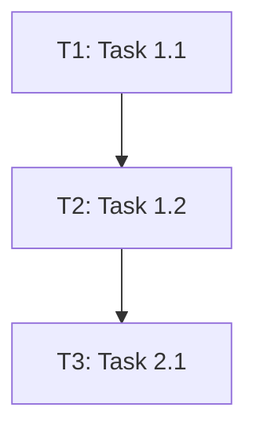

# Plan: <title>

## Goal
- <single-sentence target outcome>

## Constraints
- <non-negotiable limits>

## Out of scope
- <what this plan explicitly will not do>

## Assumptions
- <assumption 1>
- <assumption 2>

## Orchestration strategy
- Mode: `swarm-waves | super-swarm`
- Why this mode:
  - <accuracy vs speed trade-off rationale>

## Phase 1: <name>

### Task 1.1: <name>
- Status: `todo`
- Dependency ID: `T1`
- Task board ID: `T-###` (optional)
- depends_on: `[]`
- Files:
  - `<path>`
- Deliverables:
  - `<artifact>`
- Verification:
  - Command(s): `<command>` OR
  - Checklist: `<manual verification checklist>`
- Definition of done:
  - `<clear completion signal>`
- Parallel-safe: `yes|no`

### Task 1.2: <name>
- Status: `todo`
- Dependency ID: `T2`
- Task board ID: `T-###` (optional)
- depends_on: `[T1]`
- Files:
  - `<path>`
- Deliverables:
  - `<artifact>`
- Verification:
  - Command(s): `<command>` OR
  - Checklist: `<manual verification checklist>`
- Definition of done:
  - `<clear completion signal>`
- Parallel-safe: `yes|no`

## Phase 2: <name>

### Task 2.1: <name>
- Status: `todo`
- Dependency ID: `T3`
- Task board ID: `T-###` (optional)
- depends_on: `[T2]`
- Files:
  - `<path>`
- Deliverables:
  - `<artifact>`
- Verification:
  - Command(s): `<command>` OR
  - Checklist: `<manual verification checklist>`
- Definition of done:
  - `<clear completion signal>`
- Parallel-safe: `yes|no`

## Parallel execution batches
- Batch A (immediately unblocked): `<task ids>`
- Batch B (after Batch A): `<task ids>`

## Dependency graph

## Task ID mapping (required when board is used)
| Plan task ID | Board task ID | Notes |
|--------------|---------------|-------|
| 1.1 | T-101 | |
| 1.2 | T-102 | |

Rules:
- Keep mapping 1:1 for active tasks.
- Do not reuse a board ID for multiple active plan tasks.

## Orchestrator hand-off payload
- Plan path: `<plan-path>`
- First unblocked set: `<task IDs>`
- Context package per task:
  - Dependency state
  - Related tasks
  - Constraints and risks
  - Acceptance criteria
  - Verification requirements

## Risks and mitigations
- Risk: <description>
  - Mitigation: <action>

## Worker output contract
- Each worker must return:
  - Summary of changes
  - Artifacts changed (files and/or docs/notes)
  - Tests run and results
  - Open issues/blockers

## Completion criteria
- <project-level acceptance criteria>
