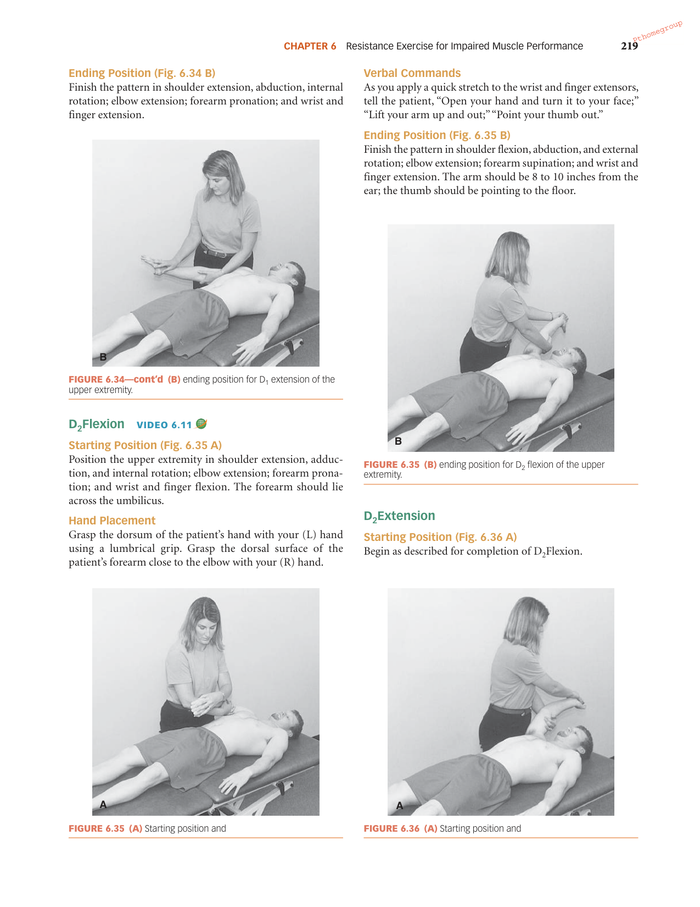
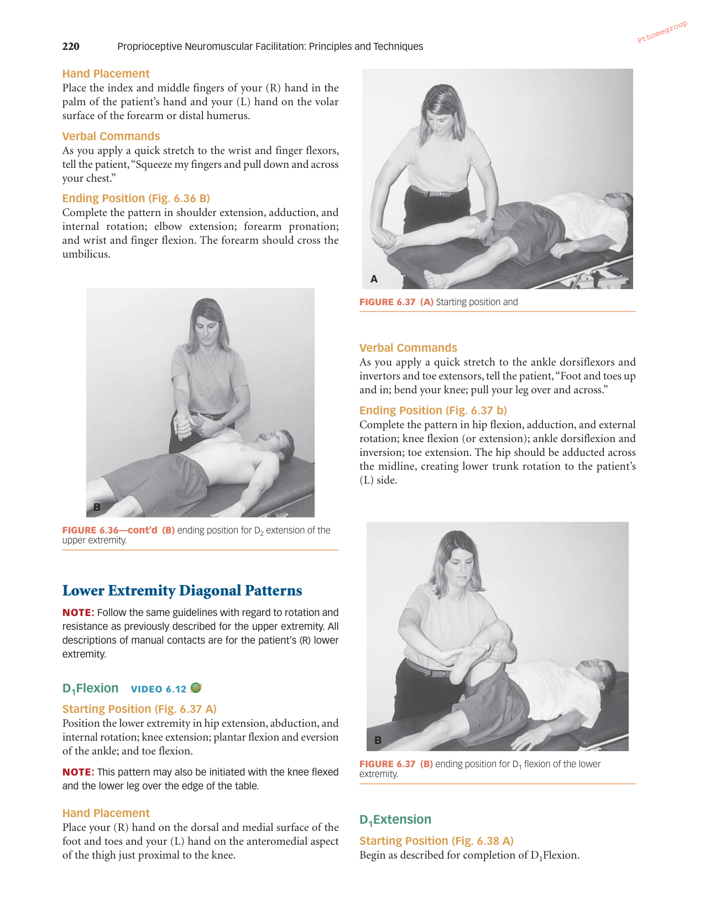
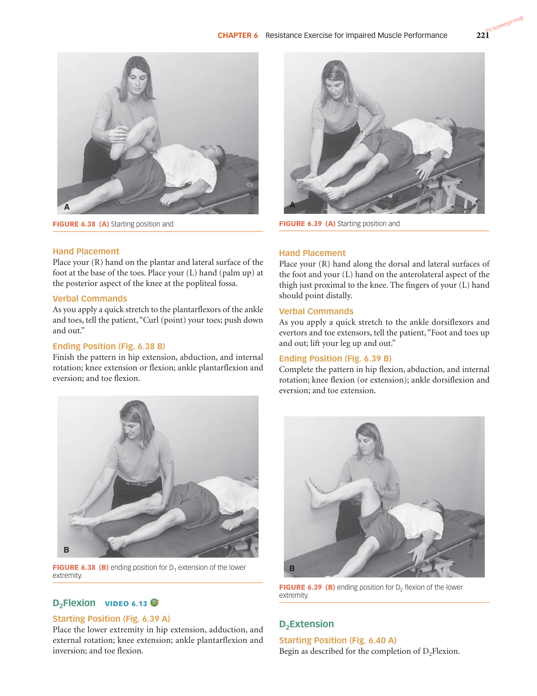
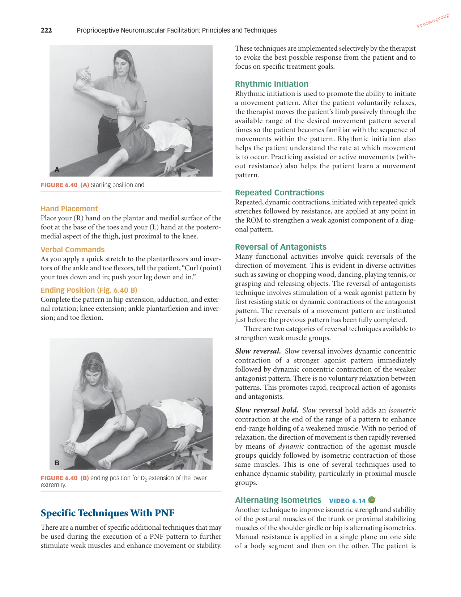

# PNF Exercise Instructions - Chapter 6

## 1. Upper Extremity D2 Flexion/Extension (Diagonal 2)
*Source: Page 219-220, Figures 6.35 & 6.36*

### D2 Flexion (The "Sword Out" motion)
*   **Starting Position (Fig. 6.35 A):** Shoulder in extension, adduction, and internal rotation; elbow in extension; forearm pronated; wrist and fingers in flexion. The forearm should lie across the umbilicus.
*   **Hand Placement:**
    *   **Left (L) Hand:** Grasp the dorsum of the patient’s hand using a lumbrical grip.
    *   **Right (R) Hand:** Grasp the dorsal surface of the patient’s forearm close to the elbow.
*   **Verbal Commands:** "Open your hand and turn it to your face; lift your arm up and out; point your thumb out."
*   **Ending Position (Fig. 6.35 B):** Shoulder in flexion, abduction, and external rotation; elbow in extension; forearm supinated; wrist and fingers in extension. The arm should be 8 to 10 inches from the ear; the thumb pointing to the floor.

### D2 Extension (The "Sword In" motion)
*   **Starting Position (Fig. 6.36 A):** Same as the ending position of D2 Flexion.
*   **Hand Placement:**
    *   **Right (R) Hand:** Place index and middle fingers in the palm of the patient’s hand.
    *   **Left (L) Hand:** On the volar surface of the forearm or distal humerus.
*   **Verbal Commands:** "Squeeze my fingers and pull down and across your chest."
*   **Ending Position (Fig. 6.36 B):** Complete the pattern in shoulder extension, adduction, and internal rotation; forearm pronated; wrist and finger flexion. Forearm should cross the umbilicus.

---

## 2. Upper Extremity D2 Flexion/Extension with Slow Reversal Holds
*Source: Page 222, "Slow Reversal Hold" Technique*

### Technique Application
1.  **Concentric Phase:** Perform the **D2 Flexion** pattern as described above.
2.  **The Hold:** At the end of the range (abduction/external rotation), command the patient to **"Hold"** while you apply an isometric contraction to the agonist muscles. There should be no joint movement.
3.  **The Reversal:** With no period of relaxation, immediately shift your resistance to the **D2 Extension** pattern.
4.  **The Hold:** At the end of the extension range (adduction across the chest), command the patient to **"Hold"** again for an isometric contraction of the extension muscles.
*   **Goal:** To enhance end-range holding of weakened muscles and increase dynamic stability.

---

## 3. Lower Extremity D1 Flexion/Extension (Diagonal 1)
*Source: Page 220-221, Figures 6.37 & 6.38*

### D1 Flexion (The "Hackey Sack" motion)
*   **Starting Position (Fig. 6.37 A):** Hip in extension, abduction, and internal rotation; knee in extension; ankle in plantar flexion and eversion; toes in flexion.
*   **Hand Placement:**
    *   **Right (R) Hand:** On the dorsal and medial surface of the foot and toes.
    *   **Left (L) Hand:** On the anteromedial aspect of the thigh just proximal to the knee.
*   **Verbal Commands:** "Foot and toes up and in; bend your knee; pull your leg over and across."
*   **Ending Position (Fig. 6.37 B):** Hip in flexion, adduction, and external rotation; ankle in dorsiflexion and inversion; toes in extension. The hip should be adducted across the midline.

### D1 Extension
*   **Starting Position (Fig. 6.38 A):** Same as the ending position of D1 Flexion.
*   **Hand Placement:**
    *   **Right (R) Hand:** On the plantar and lateral surface of the foot at the base of the toes.
    *   **Left (L) Hand:** Palm up at the posterior aspect of the knee (popliteal fossa).
*   **Verbal Commands:** "Curl (point) your toes; push down and out."
*   **Ending Position (Fig. 6.38 B):** Hip in extension, abduction, and internal rotation; ankle in plantarflexion and eversion; toes in flexion.

---

## 4. Lower Extremity D1 Flexion/Extension with Hold-Relax Stretching
*Source: Adapted from Chapter 6 "Slow Reversal Hold" and PNF Principles*

*Note: Hold-Relax is typically a stretching technique (Chapter 4). In the context of Chapter 6 resistance, the closest isometric technique is the Slow Reversal Hold.*

### Technique Application
1.  **D1 Flexion:** Perform the D1 Flexion pattern.
2.  **The Hold:** At the end of the flexion/adduction range, command the patient to **"Hold"** against your resistance. This is an isometric contraction of the *agonists* (flexors/adductors).
3.  **Relax/Stretch:** The patient then relaxes, and you passively move the limb further into the D1 Flexion diagonal to increase the stretch on the extensors/abductors.
4.  **Alternate (Slow Reversal Hold):** For stability, immediately reverse into the **D1 Extension** pattern after the hold.

---

## Exercise Images from the Textbook (Pages 218 - 221)

Below are the rendered pages from the textbook that display the corresponding figures for the PNF exercises described above.

### Page 218 (Reference for UE D1)

### Page 219 (Reference for UE D2)

### Page 220 (Reference for UE D2 & LE D1)

### Page 221 (Reference for LE D1 & LE D2)

