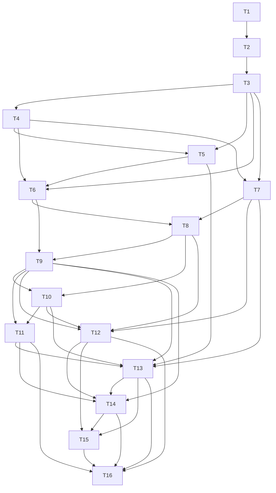

# Implementation Plan: Harness Engineering Readiness

**Track ID:** trey-agent-repo-readiness_20260313  
**Spec:** [./spec.md](./spec.md)  
**Created:** 2026-03-13  
**Status:** In progress; `T1`-`T7` complete

## Goal

Make this repo confidently harness-ready by giving every supported agent the same repo-local harness contract, isolated startup path, deterministic validation scenarios, machine-readable artifacts, and CI-backed proof.

## Constraints

- Keep root `AGENTS.md` as the governing project instruction surface.
- Preserve `Start_Dashboard.bat` as the operator-default manual launcher.
- Reuse the strongest existing test, smoke, and report surfaces instead of replacing them wholesale.
- Do not introduce a new task or board system alongside Conductor and the existing repo execution surfaces.
- Treat missing repo-local instruction and setup docs as baseline gaps to resolve, not assumptions to inherit.
- Do not mutate the active tutor/layout planning surfaces during this planning pass; keep the work isolated to this track folder and the shared skill.

## Out of scope

- Shipping the full harness implementation in this planning pass.
- Rewriting Tutor product behavior outside what the harness contract requires.
- Deleting live/operator smoke paths.
- Building one-off harnesses that only work for a single agent tool.

## Assumptions

- Supported agents can all run repo-local shell commands even if their home-directory setup differs.
- The missing worktree/bootstrap scripts described in `scripts/README.md` are documentation drift, not hidden runtime dependencies.
- Queue conversion should wait until the durable plan is accepted and the first execution wave is explicitly selected.

## Release proof

The repo is ready to close this track when:

- a documented repo-local harness entrypoint exists and is the same for all supported Tier 1 agents
- harness startup supports isolated per-run ports and data roots without clobbering another run
- at least one fixture-backed Tutor harness scenario passes without operator-local data
- harness runs emit a standard machine-readable artifact bundle with redacted environment data
- CI runs the core harness lane in addition to current tests
- docs match repo reality for startup, harness commands, and multi-agent support
- one retained live/operator smoke remains in the release proof alongside the first hermetic scenario

## Backward build chain

- Release proof depends on: shared harness contract, isolated startup, hermetic scenario(s), artifact schema, observability, CI parity, and cross-agent validation.
- Those depend on: a frozen contract for commands, env/bootstrap rules, and supported agent expectations.
- Those depend on: a grounded baseline inventory and track bootstrap.

## Phases and tasks

- `0.1 / T1 / done` Open the durable planning surface in isolation. `depends_on: []`. `Surfaces:` `conductor/tracks/trey-agent-repo-readiness_20260313/`, `C:\Users\treyt\.agents\skills\trey-agent-repo-readiness\`. `DoD:` the reusable shared skill exists, the isolated track folder exists, and no active tutor/layout planning surfaces were mutated. `Verification:` shared skill sync passes and the isolated track artifacts are present on disk. `Parallel:` no.
- `0.2 / T2 / done` Capture the harness baseline inventory from actual repo state. `depends_on: [T1]`. `Surfaces:` `Start_Dashboard.bat`, `scripts/README.md`, `scripts/`, `.github/workflows/ci.yml`, `brain/config.py`, `brain/tests/`, `dashboard_rebuild/`, `conductor/tracks/trey-agent-repo-readiness_20260313/findings.md`. `DoD:` one grounded artifact names strengths, gaps, missing surfaces, actual startup/test/build/smoke entrypoints, and the missing repo-local planner template paths. `Verification:` checked existence/non-existence list against startup, env, CI, tests, smoke scripts, docs, and planner template paths. `Parallel:` no.
- `1.1 / T3 / done` Freeze the shared repo-local harness contract. `depends_on: [T2]`. `Surfaces:` `conductor/tracks/trey-agent-repo-readiness_20260313/contract-harness-command-surface.md`, future harness command surface under `scripts/`, track `spec.md`, track `plan.md`, `docs/root/GUIDE_DEV.md`. `DoD:` one explicit command contract covers `bootstrap`, `run`, `eval`, and `report`, including owning scripts and expected arguments. `Verification:` command matrix maps cleanly onto real repo startup/build/test surfaces with no placeholder commands. `Parallel:` no.
- `1.2 / T4 / done` Freeze the environment/bootstrap contract. `depends_on: [T3]`. `Surfaces:` `conductor/tracks/trey-agent-repo-readiness_20260313/contract-env-bootstrap.md`, `brain/config.py`, `dashboard_rebuild/.env.example`, future backend env template/validator, `docs/root/GUIDE_DEV.md`. `DoD:` required env vars, setup checks, live-only prerequisites, and hermetic prerequisites are separated cleanly with explicit precedence rules. `Verification:` env/bootstrap table names each variable or prerequisite, its source, whether it is required for live or hermetic runs, and the deterministic failure class if missing. `Parallel:` no.
- `1.3 / T5 / done` Freeze the cross-agent compatibility contract. `depends_on: [T3,T4]`. `Surfaces:` `conductor/tracks/trey-agent-repo-readiness_20260313/contract-agent-compatibility-matrix.md`, root `AGENTS.md`, track `spec.md`, track `plan.md`, future harness docs, shared skill topology assumptions. `DoD:` a tiered supported-agent matrix states how Claude, Codex, Gemini, Cursor, OpenCode, and Antigravity use the same harness entrypoints, while conditional tools such as Kimi or Conduit are explicitly marked pending unless repo-local proof exists. `Verification:` each matrix row names the exact repo-local command surface, required tool glue, and whether it is Tier 1 proof or Tier 2 pending. `Parallel:` no.
- `2.1 / T6 / done` Implement isolated startup for harness runs without breaking operator launch. `depends_on: [T3,T4,T5]`. `Surfaces:` `Start_Dashboard.bat`, new harness launcher script(s), backend config/startup entrypoints, docs. `DoD:` harness startup accepts port, data-root, and artifact/log overrides and can run alongside the operator-default manual launch path. `Verification:` `pytest brain/tests/test_harness_startup.py`; operator launch verified on `5000` via `Start_Dashboard.bat`; hermetic harness launch verified on a second port with temp data/artifact roots and metadata at `%TEMP%\harness-coexistence-artifacts\run.json`; both endpoints returned `200` concurrently; harness cleanup left the operator launch intact. `Parallel:` no.
- `2.2 / T7 / done` Implement a repo-local harness bootstrap and setup validator. `depends_on: [T3,T4]`. `Surfaces:` `scripts/harness.ps1`, `brain/.env.example`, `brain/tests/fixtures/harness/manifest.json`, `brain/tests/test_harness_bootstrap.py`, `docs/root/GUIDE_DEV.md`, `conductor/tracks/trey-agent-repo-readiness_20260313/t7-bootstrap-validator.md`. `DoD:` one command verifies dependency, env, and fixture prerequisites and explains failures with deterministic nonzero exits. `Verification:` `python -m pytest brain/tests/test_harness_bootstrap.py -q`; `python -m pytest brain/tests/test_harness_startup.py -q`; `powershell -NoProfile -ExecutionPolicy Bypass -File scripts/harness.ps1 -Mode Bootstrap -Profile Hermetic -Json`; `powershell -NoProfile -ExecutionPolicy Bypass -File scripts/harness.ps1 -Mode Bootstrap -Profile Live -Json`; `python scripts/check_docs_sync.py`; `git diff --check`. `Parallel:` no.
- `2.3 / T8 / todo` Build the first hermetic Tutor fixture scenario. `depends_on: [T6,T7]`. `Surfaces:` fixture data/seed path, smoke/eval scripts, tests, docs. `DoD:` a fixture-backed scenario runs with temp data roots and no dependency on Obsidian vault state, live course or material data, or provider credentials. `Verification:` repeated green runs against isolated temp data with `brain/.env` ignored or overridden, no provider credentials, and no personal-state dependency. `Parallel:` no.
- `3.1 / T9 / todo` Standardize the machine-readable harness artifact bundle. `depends_on: [T6,T8]`. `Surfaces:` harness runner/report script(s), smoke outputs, artifact schema doc. `DoD:` each harness run emits a consistent JSON bundle with command results, exit codes, timings, git SHA, scenario ID, and a redacted environment summary. `Verification:` schema review plus two consecutive runs of the same scenario produce the same artifact shape and no secret leakage. `Parallel:` no.
- `3.2 / T10 / todo` Convert the key validation flows into named harness scenarios. `depends_on: [T8,T9]`. `Surfaces:` `scripts/smoke_golden_path.ps1`, `scripts/smoke_tutor_readonly.ps1`, `scripts/method_integrity_smoke.py`, backend and frontend test commands, browser harness surfaces, docs. `DoD:` scenarios are named, selectable, and labeled as `hermetic` or `live/operator`, with expected artifacts and pass/fail gates. `Verification:` scenario registry review plus green runs for the first selected set, with no references to missing scripts. `Parallel:` no.
- `3.3 / T11 / todo` Add structured harness observability. `depends_on: [T9,T10]`. `Surfaces:` harness logs/report outputs, startup/eval scripts, docs. `DoD:` failures are traceable through structured JSONL or equivalent run-linked artifacts rather than only console text, with redaction rules applied. `Verification:` one induced failed run produces inspectable structured diagnostics and passes the artifact redaction check. `Parallel:` no by default.
- `4.1 / T12 / todo` Add a CI harness lane that exercises the shared contract. `depends_on: [T7,T8,T9,T10]`. `Surfaces:` `.github/workflows/ci.yml`, harness scripts, fixture assets, frontend build/test wiring. `DoD:` CI runs the agreed harness bootstrap and at least one hermetic scenario in addition to current tests, with the platform split documented explicitly. `Verification:` workflow syntax check plus successful local execution of the exact lane commands in the matching Windows and or Ubuntu environments required by the workflow. `Parallel:` no.
- `4.2 / T13 / todo` Prove cross-agent compatibility against the shared harness surface. `depends_on: [T5,T7,T9,T10,T11]`. `Surfaces:` root `AGENTS.md`, future harness docs, optional agent smoke scripts or notes, stored artifact bundles. `DoD:` every Tier 1 agent in the matrix uses the same repo-local harness entrypoints and records comparable proof artifacts; Tier 2 tools remain explicitly pending if not yet evidenced. `Verification:` stored per-agent artifacts or transcripts for the full Tier 1 set, not sampled-only evidence. `Parallel:` no.
- `5.1 / T14 / todo` Remove harness-related doc drift and rewrite docs to the shipped contract. `depends_on: [T9,T11,T12,T13]`. `Surfaces:` `docs/root/GUIDE_DEV.md`, `scripts/README.md`, missing coordination/setup/canon surfaces as needed, other active runbook surfaces. `DoD:` docs describe only real scripts, real template paths, real commands, and the current harness contract. `Verification:` docs reality check against disk, applicable repo doc checks, and replacement of missing repo-local planner template references with the shared fallback path or repo-local copies. `Parallel:` no.
- `5.2 / T15 / todo` Decide the Conductor-vs-planner execution split for implementation. `depends_on: [T12,T13,T14]`. `Surfaces:` track `plan.md`, optional planner conversion artifact. `DoD:` only the first explicit unblocked execution wave is marked queue-ready; later waves remain in the durable plan. `Verification:` `C:\Users\treyt\.agents\skills\treys-swarm-planner\templates\task_conversion_template.md` preconditions explicitly check `yes / yes / yes` before any conversion. `Parallel:` no.
- `5.3 / T16 / todo` Run the integrated closeout gate and close the track. `depends_on: [T11,T12,T13,T14,T15]`. `Surfaces:` track docs, CI workflow, harness scripts, docs. `DoD:` release proof passes, no review findings remain unresolved, and closeout evidence is recorded. `Verification:` final harness bootstrap, first hermetic scenario, one retained live/operator smoke, docs sync, CI lane validation, and full Tier 1 cross-agent evidence bundle. `Parallel:` no.

## Parallel batches

- Run the contract-freeze phase serially: `T2 -> T3 -> T4 -> T5`.
- After contract freeze, implementation should stay serial by default because startup, env, scenario, artifact, observability, CI, and docs surfaces are tightly coupled.
- Only re-introduce parallel execution after the implementation team has split write scopes into disjoint files and named a single merge owner.

## Dependency graph

## Audit prompts/findings

- Review prompt source:
  - missing repo-local path: `C:\pt-study-sop\.codex\skills\treys-swarm-planner-repo\review_prompt_template.md`
  - shared fallback used: `C:\Users\treyt\.agents\skills\treys-swarm-planner\templates\review_prompt_template.md`
- Required reviewers: minimum `2`, preferred `3` because this is cross-subsystem and architecture-heavy.
- Review results are recorded in [./review.md](./review.md).

Accepted review set:

- `Leibniz`: valid, `reject`
- `Turing`: valid, `accept with revisions`
- `Locke`: invalid, not adopted because the review contradicted local disk state on key grounding facts

## Revised final plan

Key revisions after review:

- refreshed the baseline to actual repo state
- serialized `T3` through `T5`
- tightened dependencies across `T4`, `T6`, `T12`, `T13`, `T14`, and `T16`
- replaced missing repo-local planner template references with shared fallback paths
- strengthened verification gates for operator-launch regression, deterministic failure classes, hermetic proof, redaction, CI platform strategy, and stored cross-agent evidence

## First unblocked wave

- Durable plan work now:
  1. `T1` is complete
  2. `T2` is complete
  3. `T3` is complete
  4. `T4` is complete
  5. `T5` is complete
  6. `T6` is complete
  7. `T7` is complete
  8. `T8` is the only explicit next unblocked execution task
- Planner queue conversion:
  - deferred until the revised plan is accepted in the shared execution system and the user authorizes touching active planning surfaces

## Conductor vs planner split

- `Conductor` owns:
  - final goal
  - constraints and assumptions
  - contract decisions
  - dependency graph
  - audit findings
  - the full multi-phase roadmap
- `Planner queue` should own only:
  - the first explicitly unblocked implementation wave after acceptance
  - queue-ready tasks with parent IDs, verification commands, and dependency notes
