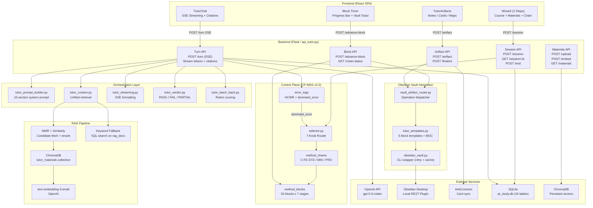
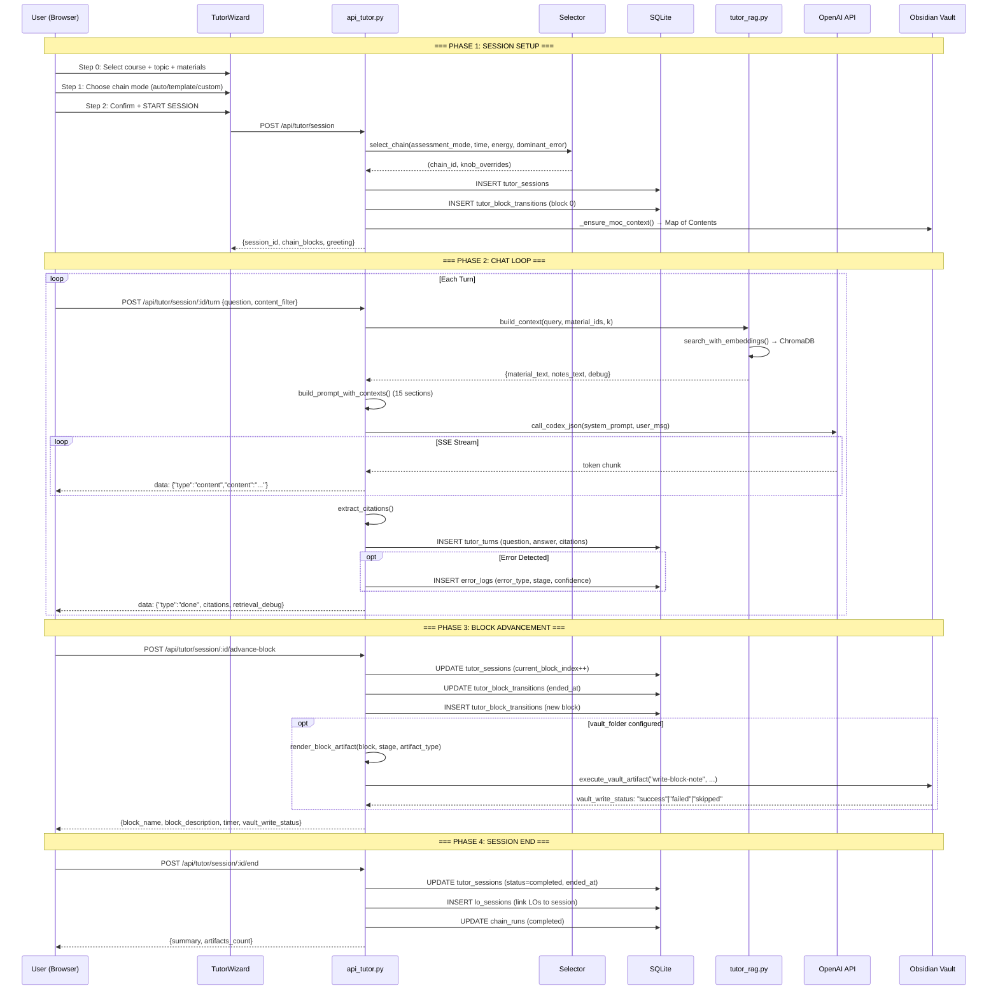
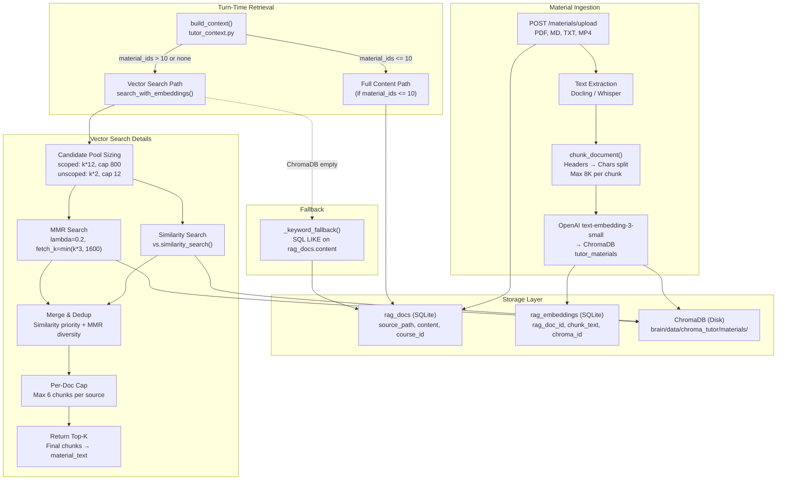
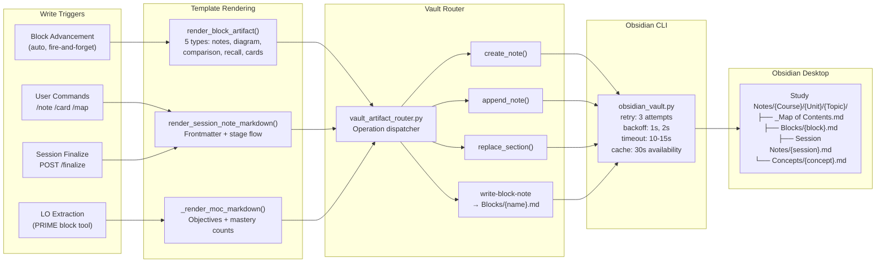
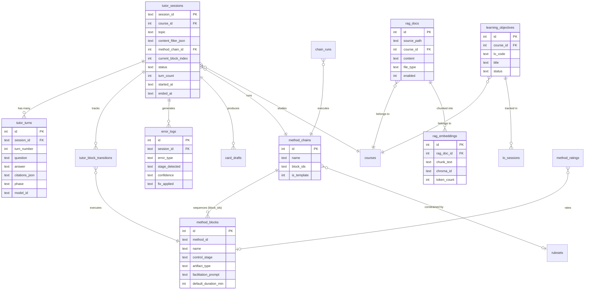

# Tutor System Architecture

> Generated 2026-03-03. Comprehensive visual map of the PT Study Tutor system.
> Historical note: this document describes the pre-shell, wizard-led Tutor surface and is preserved as historical evidence only. Current product authority lives in `README.md`, runtime wiring lives in `docs/root/PROJECT_ARCHITECTURE.md`, and launch/start-panel cleanup evidence lives in `conductor/tracks/tutor-launch-shell-realignment_20260313/`.

---

## 1. High-Level System Overview



---

## 2. User Session Lifecycle



---

## 3. Control Plane Pipeline

```mermaid
graph LR
    subgraph Selector["7-Knob Selector"]
        K1["assessment_mode"]
        K2["time_available_min"]
        K3["energy"]
        K4["dominant_error"]
        K5["phase"]
        K6["course_type"]
        K7["prior_mastery"]
    end

    subgraph Routing["Chain Selection Rules"]
        R1["energy=low OR time<25<br/>→ C-FE-MIN"]
        R2["mode=procedure<br/>→ C-FE-PRO"]
        R3["mode=definition/recognition<br/>→ C-FE-MIN"]
        R4["default<br/>→ C-FE-STD"]
    end

    subgraph Pipeline["6-Stage Pipeline"]
        PRIME["PRIME<br/>Structure Extraction<br/>LO Primer + Schema"]
        CAL["CALIBRATE<br/>Baseline Measurement<br/>Micro Precheck"]
        ENC["ENCODE<br/>Deep Internalization<br/>Comparison Table"]
        REF["REFERENCE<br/>External Offloading<br/>One-Page Anchor + Q-Bank"]
        RET["RETRIEVE<br/>Reconstructive Recall<br/>Timed Sprint Sets"]
        OVR["OVERLEARN<br/>Fluency / Automaticity<br/>Exit Ticket"]
    end

    subgraph Feedback["Error-Driven Feedback"]
        EL["error_logs table"]
        DE["get_dominant_error()"]
        OV["Knob Overrides"]
    end

    Selector --> Routing
    Routing --> Pipeline
    PRIME --> CAL --> ENC --> REF --> RET --> OVR

    RET -.->|errors detected| EL
    EL --> DE
    DE -->|next session| OV
    OV -->|override knobs| Selector

    style PRIME fill:#4a9eff,color:#fff
    style CAL fill:#f5a623,color:#fff
    style ENC fill:#7ed321,color:#fff
    style REF fill:#bd10e0,color:#fff
    style RET fill:#d0021b,color:#fff
    style OVR fill:#9013fe,color:#fff
```



### Chain Compositions

```
C-FE-STD (Standard First Exposure) — 35 min, medium energy
┌──────────┬───────────┬───────────┬───────────┬───────────┬───────────┬───────────┐
│  PRIME   │  PRIME    │ CALIBRATE │  ENCODE   │ REFERENCE │ REFERENCE │ RETRIEVE  │
│ M-PRE-010│ M-PRE-008 │ M-CAL-001 │ M-ENC-010 │ M-REF-003 │ M-REF-004 │ M-RET-007 │
│ LO Primer│ Struct Ext│ Precheck  │ Compare   │ Anchor    │ Q-Bank    │ Sprints   │
└──────────┴───────────┴───────────┴───────────┴───────────┴───────────┴───────────┘

C-FE-MIN (Minimal / Low Energy) — 20 min, low energy
┌──────────┬───────────┬───────────┬───────────┬───────────┐
│  PRIME   │  PRIME    │ REFERENCE │ RETRIEVE  │ OVERLEARN │
│ M-PRE-010│ M-PRE-008 │ M-REF-003 │ M-RET-001 │ M-OVR-001 │
│ LO Primer│ Struct Ext│ Anchor    │ Free Recall│ Exit Tick │
└──────────┴───────────┴───────────┴───────────┴───────────┘

C-FE-PRO (Procedure / Lab) — 45 min, high energy
┌──────────┬───────────┬───────────┬───────────┬───────────┬───────────┐
│  PRIME   │  PRIME    │  ENCODE   │ REFERENCE │INTERLEAVE │ RETRIEVE  │
│ M-PRE-010│ M-PRE-008 │ M-ENC-011 │ M-REF-003 │ M-ELB-003 │ M-RET-007 │
│ LO Primer│ Struct Ext│ Flowchart │ Anchor    │ Case Walk │ Sprints   │
└──────────┴───────────┴───────────┴───────────┴───────────┴───────────┘
```

### Error → Override Routing

```
Confusion  → near_miss_intensity: "high" (force Contrast Matrix)
Speed      → timed: "hard" (strict timing enforcement)
Rule       → near_miss_intensity: "high" (adversarial lures)
Procedure  → override chain to C-FE-PRO
Computation→ force M-ENC-015 (Faded Scaffolding)
```

---

## 4. RAG Retrieval Pipeline



### Accuracy Profile → Retrieval Depth

```
strict    → material_k = max(6, len(material_ids))    → high precision, fewer chunks
balanced  → material_k = max(8, len(material_ids)*2)  → moderate breadth
coverage  → material_k = max(12, len(material_ids)*3) → maximum breadth
```

---

## 5. Vault Write Pipeline



---

## 6. Database Entity Relationships



---

## 7. Turn Processing Detail (The Core Loop)

```
POST /api/tutor/session/:id/turn  {question, content_filter}
│
├─ 1. LOAD SESSION
│     └─ Fetch tutor_sessions row + last 20 turns
│
├─ 2. RESOLVE CHAIN CONTEXT
│     ├─ _build_chain_info() → current block + stage
│     ├─ Validate method contract (stage drift check)
│     └─ Load facilitation_prompt + artifact_type
│
├─ 3. PARSE CONTENT FILTER
│     ├─ material_ids (which files to search)
│     ├─ accuracy_profile (strict / balanced / coverage)
│     ├─ reference_targets (bounds enforcement)
│     └─ objective_scope (module_all / single_focus)
│
├─ 4. RESOLVE RETRIEVAL DEPTH
│     ├─ _resolve_material_retrieval_k(material_ids, profile) → material_k
│     └─ _resolve_instruction_retrieval_k(profile) → instruction_k
│
├─ 5. BUILD UNIFIED CONTEXT  (tutor_context.py)
│     ├─ _fetch_materials() → ChromaDB or full content
│     ├─ _fetch_notes() → Obsidian vault search
│     └─ _fetch_vault_state() → MOC + session context
│
├─ 6. BUILD SYSTEM PROMPT  (tutor_prompt_builder.py)
│     ├─ [1] Block/chain context
│     ├─ [2] Instruction context (SOP rules)
│     ├─ [3] Material context (retrieved excerpts)
│     ├─ [4] Graph context (optional)
│     ├─ [5] Course map
│     ├─ [6] Vault state (MOC, objectives)
│     ├─ [7] Accuracy profile guidance
│     ├─ [8] Reference bounds
│     ├─ [9] PRIME guardrails (if PRIME stage)
│     ├─ [10] LO extraction prompt (if PRIME first turn)
│     ├─ [11] Material scope labels
│     ├─ [12] Tooling instructions
│     ├─ [13] Behavior override suffix
│     ├─ [14] Adaptive scaffolding (BKT mastery)
│     └─ [15] Scholar method recommendations
│
├─ 7. CALL LLM  (OpenAI gpt-5.3-codex)
│     ├─ Stream tokens via SSE
│     ├─ data: {"type":"content","content":"..."}
│     └─ (repeat until generation complete)
│
├─ 8. POST-GENERATION
│     ├─ extract_citations() → [Source: filename] parsing
│     ├─ Parse verdict (if evaluate mode)
│     ├─ Parse teach-back rubric (if teach_back mode)
│     └─ _build_retrieval_debug_payload() → confidence score
│
├─ 9. SEND DONE EVENT
│     └─ data: {"type":"done", citations, retrieval_debug, verdict}
│
└─ 10. PERSIST
      ├─ INSERT tutor_turns (question, answer, citations_json)
      ├─ UPDATE tutor_sessions (turn_count++)
      └─ INSERT error_logs (if errors detected)
```

---

## 8. Frontend Component Tree

```
TutorPage (tutor.tsx)
├── TutorWizard (when no active session)
│   ├── Step 0: StepCourseAndMaterials
│   │   ├── Course Dropdown (from /api/tutor/course-map)
│   │   ├── Topic Input
│   │   ├── PRIME Scope Selector (module_all / single_focus)
│   │   └── MaterialSelector (multi-select with counts)
│   ├── Step 1: StepChain
│   │   ├── Mode Selector (PRE-BUILT / CUSTOM / AUTO)
│   │   ├── Template Chain Dropdown (if PRE-BUILT)
│   │   └── TutorChainBuilder (if CUSTOM)
│   └── Step 2: StepConfirm
│       ├── Summary Display
│       └── START SESSION Button
│
├── TutorChat (when active session)
│   ├── Sources Drawer (left sidebar)
│   │   ├── Materials Tab (checkboxes for file selection)
│   │   ├── Vault Tab (recursive folder tree)
│   │   └── North Star Tab (MOC context)
│   ├── Chat Messages
│   │   ├── User Message (right-aligned)
│   │   └── Assistant Message (left-aligned)
│   │       ├── Markdown Renderer
│   │       ├── Citation Footnotes [1] [2]
│   │       ├── VerdictBadge (PASS/FAIL/PARTIAL)
│   │       └── TeachBackBadge (accuracy/breadth/synthesis)
│   ├── Input Bar
│   │   ├── Text Input
│   │   ├── Behavior Override (evaluate / teach_back / concept_map)
│   │   └── Send Button
│   └── Block Progress Bar
│       ├── Current Block Name + Stage
│       ├── Timer (MM:SS countdown)
│       ├── ADVANCE BLOCK Button
│       └── Progress: N / Total
│
└── TutorArtifacts (right sidebar)
    ├── Artifact List (notes, cards, maps, tables)
    ├── Artifact Preview (first 200 chars)
    ├── Bulk Delete Controls
    └── Recent Sessions List
```

---

## 9. Key File Reference

| Layer | File | Lines | Purpose |
|-------|------|-------|---------|
| **Frontend** | `dashboard_rebuild/client/src/pages/tutor.tsx` | ~1200 | Main tutor page, wizard, state |
| **Frontend** | `dashboard_rebuild/client/src/components/TutorChat.tsx` | ~1900 | Chat loop, SSE, sources drawer |
| **Frontend** | `dashboard_rebuild/client/src/components/TutorWizard.tsx` | ~740 | 3-step setup wizard |
| **Frontend** | `dashboard_rebuild/client/src/components/TutorArtifacts.tsx` | ~300 | Artifact display panel |
| **Frontend** | `dashboard_rebuild/client/src/api.ts` | ~700 | API client functions + types |
| **Backend** | `brain/dashboard/api_tutor.py` | ~7200 | 40+ endpoints, session/turn/block |
| **Orchestration** | `brain/tutor_context.py` | ~200 | Unified context builder |
| **Orchestration** | `brain/tutor_prompt_builder.py` | ~400 | 15-section system prompt |
| **Orchestration** | `brain/tutor_streaming.py` | ~150 | SSE formatting + citations |
| **Orchestration** | `brain/tutor_verdict.py` | ~100 | Verdict parsing |
| **Orchestration** | `brain/tutor_teach_back.py` | ~100 | Teach-back rubric |
| **RAG** | `brain/tutor_rag.py` | ~700 | ChromaDB + MMR retrieval |
| **Control Plane** | `brain/selector.py` | ~70 | 7-knob chain selector |
| **Control Plane** | `brain/selector_bridge.py` | ~175 | Selector API bridge |
| **Control Plane** | `brain/data/seed_methods.py` | ~1770 | 46 method block definitions |
| **Vault** | `brain/obsidian_vault.py` | ~400 | CLI wrapper (retry/cache) |
| **Vault** | `brain/vault_artifact_router.py` | ~100 | Operation dispatcher |
| **Vault** | `brain/tutor_templates.py` | ~745 | Template renderers |
| **Database** | `brain/db_setup.py` | ~2500 | Schema + migrations |
| **SOP** | `sop/library/17-control-plane.md` | ~40 | CP-MSS v2.0 spec |
| **Chains** | `sop/library/chains/C-FE-STD.yaml` | ~37 | Standard chain |
| **Chains** | `sop/library/chains/C-FE-MIN.yaml` | ~31 | Minimal chain |
| **Chains** | `sop/library/chains/C-FE-PRO.yaml` | ~30 | Procedure chain |

---

## 10. Numbers At a Glance

| Metric | Count |
|--------|-------|
| API Endpoints | 40+ |
| Database Tables (tutor) | 16 |
| Method Blocks | 46 |
| Control Plane Stages | 6 |
| Template Chains | 3 (FE-STD, FE-MIN, FE-PRO) |
| Selector Knobs | 7 |
| System Prompt Sections | 15 |
| Block Artifact Templates | 5 |
| Frontend Components | 5 main (Page, Wizard, Chat, Artifacts, API) |
| Test Files | 5 (141 targeted tests) |
| Full Test Suite | 916 passing |
