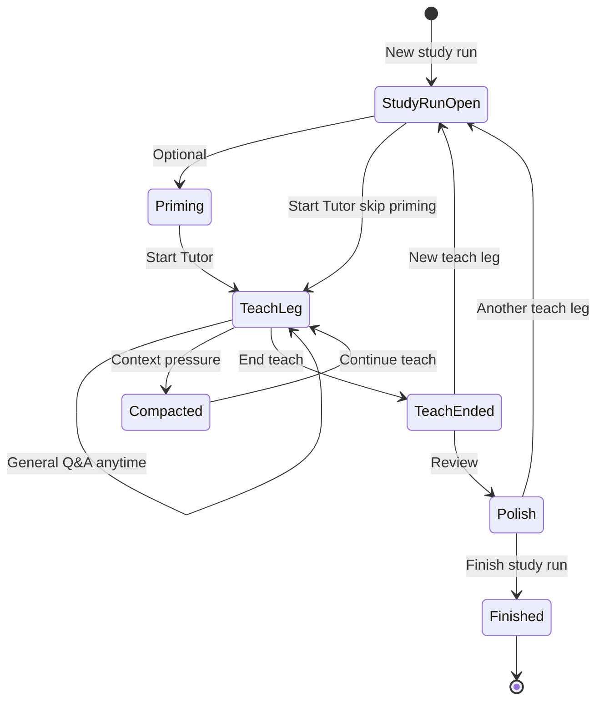

# Tutor Behavior Spec (Target)

> **Status:** Accepted product behavior from grill session (2026-05-19).  
> **Glossary:** `CONTEXT.md` (repo root).  
> **Current UI inventory:** `docs/audit/TUTOR_PAGE_AUDIT_2026-05-19.md`.  
> **Compaction architecture:** `docs/adr/0001-tutor-transcript-and-working-summary.md`.

This spec defines how `/tutor` **should** behave. Implementation gaps are listed in §8.

---

## 1. Scope

| In scope | Out of scope (for this spec) |
|----------|------------------------------|
| Study run lifecycle on `/tutor` | Brain launch handoff details |
| General Q&A vs **Tutor** teach mode | Scholar investigations |
| Transcript, compaction, polish drafts | Replacing SOP library pedagogy |
| Multi teach legs per study run | Full Final Sync UI (optional capstone later) |

---

## 2. Core entities

| Entity | ID | Lifetime |
|--------|-----|----------|
| **Study run** | `workflow_id` | Open until learner **finishes study run** |
| **Teach leg** | `tutor_session_id` | One per **Start Tutor**; ends with **End teach** |
| **Transcript** | `tutor_turns` (+ metadata) | Append-only per teach leg |
| **Working summary** | TBD table/fields | Versioned per teach leg; updated on compaction |
| **Workflow artifacts** | `tutor_captured_notes`, polish bundle, capsules | Accumulate across teach legs in one study run |

---

## 3. Learner actions (three layers)

| Action | UI label (target) | Effect |
|--------|-------------------|--------|
| **End teach** | End teach | Closes current **Tutor chat session**; study run stays open |
| **New teach** | New teach / Start Tutor | Requires **topic label** + materials + chain/method; creates new teach leg |
| **Finish study run** | Finish study run | Closes **workflow**; triggers final polish draft path; no further legs without new run |

**Hero button today:** `END SESSION` / `NEW SESSION` — must be split or relabeled to match the table (see §8).

---

## 4. General Q&A vs Tutor teach mode

### 4.1 General Q&A

- Always-on input on the **Tutor page** (Floating Studio layout).
- No material or chain/method gate.
- Lighter system prompt / retrieval profile (implementation detail).
- **Handoff:** promote-only — explicit promote to polish packet; no automatic `captured_notes` or draft ingest.
- Turns tagged `general`.

### 4.2 Tutor (teach mode)

- Started only via **Start Tutor** (not a mode toggle named “protocol”).
- **Requires:**
  - ≥1 **study material** in scope
  - **Template chain** OR **exactly one** custom method block (one-block chain at session create)
- **Recommends:** prime packet in system prompt when priming/workspace produced one; **unprimed teach** allowed with visible banner.
- Full chain UX: block facilitation, advance block, stage timer, SOP prompts.
- Turns tagged `tutor`.
- Canonical source for capture, compaction drafts, memory capsules (optional), polish promotion.

### 4.3 Shared chat session per teach leg

- One `tutor_session_id` per teach leg.
- General and **Tutor** turns can share that session; compaction summarizes **`tutor`** turns (General excluded or separate summary section).

---

## 5. Study run lifecycle



- Multiple **teach legs** per study run without finishing the run.
- Prior legs’ **transcripts** remain browseable; not merged into a new leg’s compaction.
- Polish queue is **per study run**, labeled by teach leg topic.

---

## 6. Transcript and compaction

### 6.1 Transcript

- Every user/assistant turn persisted (already: `tutor_turns`).
- Never deleted when context compacts.
- UI eventually: transcript viewer with search/jump (planned).

### 6.2 Compaction trigger

- **Auto:** token pressure ≥ high (extend current telemetry).
- **Manual:** learner “Compact now” in Memory panel or teach footer.

### 6.3 On compact

1. LLM generates new **working summary** version (`covers_turns_through`, links to prior version).
2. **Transcript** unchanged.
3. Update single **checkpoint digest** draft on workflow (`note_mode: editable`, status: draft) — not a new note per compact.
4. Optional: extract promote candidates (future).

### 6.4 Live prompt after compact

```
system (base + packet + chain block + …)
+ latest working summary
+ recency tail (last K full turns, tutor-tagged)
+ new user message
```

Default **K:** 6 tutor-tagged turns (configurable constant).

### 6.5 Memory capsule (optional, separate)

- Manual or high-pressure prompt; curated snapshot for *next* teach continuation.
- May copy from latest working summary but is not a substitute for **transcript**.

---

## 7. Polish handoff

| Source | Enters polish automatically? |
|--------|------------------------------|
| **Transcript** | No — browse/search only |
| **Working summary** | Via **draft** only |
| **Checkpoint digest** | Draft on workflow; learner approves |
| **Final digest** | Created on **End teach** or enter Polish; learner approves |
| **Promote reply** (General or Tutor) | Explicit only → `polish_packet_promoted_notes` |
| **Capture note** (Tutor) | `tutor_captured_notes`; visible in Polish |

**Approve** = learner action moves draft into polish packet / finalized note set.

**Final Sync:** optional after polish finalize; not required to **finish study run** in v1.

---

## 8. Implementation gaps (current → target)

| Area | Current | Target |
|------|---------|--------|
| Teach mode split | Single `TutorChat`; auto chain | General always-on + gated **Start Tutor** |
| Custom method | Multi-block builder | Max **one** block for custom path |
| Hero actions | END/NEW SESSION conflated | End teach / New teach / Finish study run |
| Compaction | Telemetry only | Working summary + prompt injection |
| Prompt history | Last N turns from DB | Summary + recency tail |
| Multi legs | One active session per workflow typical | Multiple `tutor_session_id` per `workflow_id` |
| Teach leg label | `hub.topic` / entry name | Required per **New teach** |
| Turn tags | None | `general` \| `tutor` on turns |
| Polish drafts | Manual capture only | Checkpoint + final auto drafts |
| Transcript UI | None on page | Searchable viewer (planned) |
| Final Sync | Component exists, not in shell | Optional capstone later |
| README / Screen inventory | Legacy Start Panel, 3-column chat | See updated README § Tutor |

---

## 9. Implementation waves

Build in order. Each wave has verifiable acceptance criteria.

### Wave 1 — Teach mode split and gates

**Goal:** General Q&A and **Tutor** teach are distinct paths with correct gates.

- [ ] Always-on General input (separate from teach stream or tagged sends).
- [ ] **Start Tutor** requires materials + (template chain OR one custom method).
- [ ] Remove **Auto tutor flow** for teach mode.
- [ ] Cap custom builder at one method block.
- [ ] Required topic label on **New teach**.
- [ ] UI copy: **Tutor page** vs **Tutor** teach mode per `CONTEXT.md`.

**Verify:** Cannot start teach without materials+chain; can ask General without teach; labels consistent in UI.

### Wave 2 — Study run lifecycle actions

**Goal:** Three-layer end/new/finish semantics.

- [ ] **End teach** closes `tutor_session_id` only; workflow stays active.
- [ ] **New teach** creates new session under same `workflow_id`.
- [ ] **Finish study run** closes workflow; distinct hero control.
- [ ] Teach leg list on workflow (topic label, status, turn count).

**Verify:** Two teach legs in one run; polish data retained; finish closes run.

### Wave 3 — Turn tags and transcript fidelity

**Goal:** Transcript ready for compaction rules.

- [ ] Persist `turn_mode: general | tutor` on each turn (API + DB migration).
- [ ] Transcript API: list turns for session with mode filter.
- [ ] Compaction input = tutor-tagged turns only.

**Verify:** General turns stored but excluded from teach compaction summary.

### Wave 4 — Working summary and compaction pipeline

**Goal:** Real compaction per ADR-0001.

- [ ] Storage for versioned working summaries per teach leg.
- [ ] Compaction job on high pressure + manual trigger.
- [ ] `send_turn` uses summary + recency tail for history.
- [ ] Memory panel: rename telemetry display to **context pressure**; compact creates summary.

**Verify:** Long teach session stays responsive; old turns recoverable from transcript API; summary versions increment.

### Wave 5 — Polish drafts

**Goal:** Organized notes without auto-flooding polish.

- [ ] Checkpoint digest upsert on compact.
- [ ] Final digest on End teach / enter Polish.
- [ ] Polish UI: draft queue vs approved; teach leg labels.
- [ ] Promote-only unchanged for General.

**Verify:** Compact updates one draft; approve moves to polish packet; General promote still explicit.

### Wave 6 — Transcript UX (optional)

- [ ] Transcript panel: search, jump to turn, filter by mode/leg.
- [ ] Link from polish to source turn in transcript.

---

## 10. Acceptance tests (smoke)

1. Open study run → General question → no chain required → not in polish until promoted.
2. **Start Tutor** with materials + template chain → block prompt visible → advance block works.
3. Custom path with exactly one method → teach starts.
4. Long conversation → compact → still see full transcript → next reply uses summary.
5. **End teach** → **New teach** with new label → two transcripts on workflow.
6. **Finish study run** → cannot add teach leg without new run.

---

## 11. Doc maintenance

When implementation changes behavior, update in order:

1. This spec (if target behavior changes)
2. `CONTEXT.md` (terms only)
3. `docs/audit/TUTOR_PAGE_AUDIT_2026-05-19.md` (as-built inventory)
4. `README.md` § Tutor Page (high-level + links)
