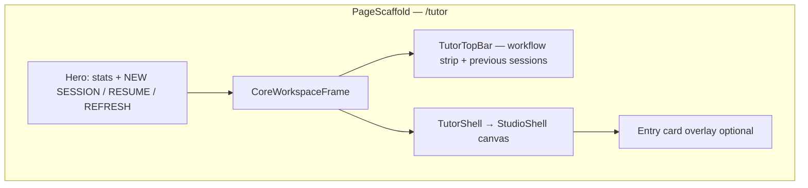
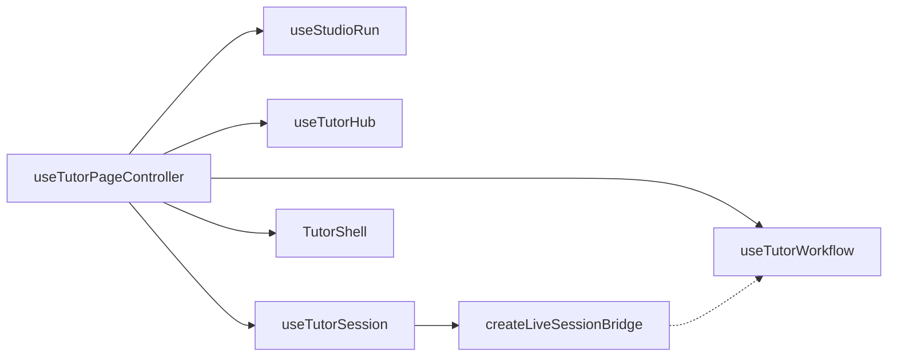

# Tutor Page Audit — Current Surface (2026-05-19)

> **Purpose:** Baseline inventory of what is on `/tutor` today and how it behaves, so polish/QA can be systematic.
> **Supersedes for UI structure:** `docs/audit/TUTOR_FULL_AUDIT.md` (March 2026, pre–Floating Studio).
> **Code entrypoints:** `dashboard_rebuild/client/src/pages/tutor.tsx`, `TutorShell.tsx`, `brain/dashboard/api_tutor*.py`.

---

## 1. What the page is

The **Tutor** route (`/tutor`) is the **Live Study Core**: a full-height workspace that runs the study pipeline **Priming → Workspace (packets/canvas) → Tutor chat → Polish**, inside a **Floating Studio** (draggable/resizable panels on an infinite canvas).

It is **not** the old three-column wizard (left filter / center chat / right artifacts). Artifacts still exist in code (`TutorArtifacts.tsx`) but are **not mounted** on the main page today (`TutorArtifactsDrawer` has no imports).

---

## 2. Visual layout (top → bottom)

| Region | Component | Role |
|--------|-----------|------|
| **Hero** | `PageScaffold` in `tutor.tsx` | Eyebrow “Live Study Core”, title Tutor, stats (Surface / Session / Course / Materials), primary actions |
| **Top bar** | `TutorTopBar` | Active workflow stage, teach runtime cards, chain timer when live, collapsible **Previous Sessions** |
| **Canvas** | `StudioShell` via `TutorShell` | Floating panels, layout presets, pan/zoom, popout support |
| **Entry overlay** | Built in `TutorShell` | “Floating Studio” setup when `showSetup && !liveTutorSessionId` |

**Layout note:** Tutor uses **canvas lock** (`useCanvasLocked`) — full viewport workspace mode on this route (`layout.tsx`).

---

## 3. Hero actions (`tutor.tsx`)

| Button | When | Behavior |
|--------|------|----------|
| **NEW SESSION** | No live tutor session and no active workflow | Flash entry card hint if setup visible with empty canvas; otherwise resets workspace home |
| **END SESSION** | Live tutor session **or** active workflow | Confirm dialog; live session → `endSessionById` + vault save toast; workflow-only → local reset (workflow stays on server for resume) |
| **RESUME** | Hub `resume_candidate` resolvable | `resumeFromHubCandidate` + `study` panel preset |
| **REFRESH** | Always | Invalidates tutor-hub, sessions, project-shell, studio-restore, chat materials, obsidian queries |

**Stats chips:** `TUTOR` surface, `LIVE` vs `READY` session, course label or `UNSCOPED`, material count.

---

## 4. Entry card (“Floating Studio”)

Shown when `showSetup === true` and there is **no** active tutor session id.

### Tabs

- **New Session** — course, session name, material multi-select, upload, primary CTAs
- **Resume Session** — `EntryResumePanel` lists up to 20 sessions (`api.tutor.listSessions`), filterable by course when course selected

### New session fields

| Field | State | Notes |
|-------|-------|-------|
| Session name | `entrySessionName` → `hub.topic` | Optional label for workflow topic |
| Course | `hub.courseId` | From `tutor/content-sources` |
| Materials | `hub.selectedMaterials` | Auto-selects all course materials until user touches selection |
| Filter | Local `entryMaterialFilter` | Client-side filter on material list |
| Upload | Hidden file input | PDF/DOCX/MP4/PPTX → library + current run (`SourceShelf` upload path) |

### CTAs

| Button | Effect |
|--------|--------|
| **Start Session** | `handleStartPrimingFromEntry` (page) → `createWorkflowAndOpenPriming` + **Prime** preset layout |
| **Skip Setup** | `setShowSetup(false)` + **Study** preset (persists entry-card dismissal via `useStudioRun`) |
| **Open Full Studio** | All panels preset (`full_studio`) — only when `showEntryFullStudioAction` |
| **Resume** (inline) | Hub resume candidate + study preset |
| **X** | Dismiss entry card (`readTutorEntryCardDismissed` / write dismissal flag) |

---

## 5. Floating panels (`StudioShell`)

Panels are identified by `panel` key in `panel_layout` (persisted per course in **project shell**).

| Panel key | Title (UI) | Content source | Primary purpose |
|-----------|------------|----------------|-----------------|
| `source_shelf` | Source Shelf | `SourceShelf` | Course/material/path selection, upload, add objects to workspace |
| `document_dock` | Document Dock | `StudioDocumentDock` | PDF/tab viewer, excerpts, clips |
| `workspace` | Workspace | `StudioWorkspaceUnified` | Prime/polish packets, concept maps, canvas objects |
| `priming_chat` | Priming | `TutorWorkflowPrimingPanel` (lazy) | Method runs, LOs, priming assist, save draft/ready, start tutor |
| `tutor_chat` | Tutor | `TutorLiveStudyPane` → `TutorChat` | Streaming Q&A, behavior modes, chain timer |
| `polish_chat` | Polish | `TutorWorkflowPolishStudio` (lazy) | Polish bundle, card requests, finalize |
| `run_config` | Run Config | `RunConfigPanel` + optional `TutorScholarStrategyPanel` | Priming methods, tutor chain, accuracy profile, objectives |
| `memory` | Memory | `MemoryPanel` | Capsules, compaction status |
| `notes` | Scratch Notes | Textarea in `TutorShell` | Per session/workflow scratchpad in `runtime_state.notesDraft` |
| `obsidian` | Obsidian | `StudioObsidianPanel` | Vault paths, note preview/push |
| `anki` | Anki | `StudioAnkiPanel` | Card drafts from polish preview |

### Layout presets (`buildStudioShellPresetLayout`)

| Preset | Panels opened |
|--------|----------------|
| `priming` | source_shelf, document_dock, priming_chat, run_config |
| `study` | document_dock, workspace, tutor_chat, memory |
| `polish` | polish_chat, workspace |
| `full_studio` | All of the above (+ notes, obsidian, anki per shell definition) |
| `minimal` | tutor_chat only |

**Canvas controls:** preset picker, clear canvas, panel drag/resize, z-order, popout windows (`studio` popout transport), viewport focus when starting priming (`startPrimingViewportFocusRequestKey`).

---

## 6. Study workflow stages

Backend type: `TutorWorkflowStage = "launch" | "priming" | "tutor" | "polish" | "final_sync"`.

| Stage | UI home | Typical transitions |
|-------|---------|---------------------|
| **priming** | `priming_chat` panel | Create workflow → run methods / assist → save bundle → “Start Tutor” |
| **tutor** | `tutor_chat` panel | `startTutorFromWorkflow` → live `TutorSession` |
| **polish** | `polish_chat` panel | From tutor footer “OPEN POLISH” or workflow stage update |
| **final_sync** | **Component exists** (`TutorWorkflowFinalSync`) but **not wired into `TutorShell` render tree** | Publish vault path + Anki card export — verify separately if still required |

### Priming panel actions (high level)

- Configure course, materials, topic, objectives, priming method IDs, optional chain/blocks
- Run priming assist (per material or selection)
- Promote results to **Prime packet** / send to workspace (incl. Mermaid concept maps)
- Save draft / mark ready (`saveWorkflowPriming`)
- **Start Tutor** → applies **study** preset + starts session with optional `packet_context` + `memory_capsule_context`

### Tutor panel (`TutorLiveStudyPane`)

**Empty state:** START SESSION (calls `session.startSession` with packet/memory/rules), optional RESUME from hub candidate.

**Live state:**

- `TutorChat` — streaming turns to `/api/tutor/session/{id}/turn` (SSE)
- Header: tutor chain template select (auto / template / custom)
- Footer actions: SAVE EXACT/EDITABLE TO VAULT, CREATE CAPSULE, OPEN POLISH
- `TutorEndSessionDialog` — end session flow

**Chat capabilities** (via `TutorChat` + session hook):

- Accuracy profile: strict / balanced / coverage
- Material scope toggles
- Behavior overrides: Socratic, Evaluate, Concept Map, Teach-Back (toggle per message)
- Artifacts created → `session.handleArtifactCreated` (session storage; no right-rail UI on page)
- Studio capture, workflow note capture, gist summarize, promote reply to polish packet, brain feedback, memory compaction

### Polish panel

- Draft/finalize polish bundle (`saveWorkflowPolish`)
- Promoted notes from tutor replies
- Card request text feeds **Anki** panel
- Back to tutor → study preset

---

## 7. Controller architecture (`tutor.tsx`)

| Hook | Responsibility |
|------|----------------|
| `useStudioRun` | Panel layout, document tabs, runtime state, board scope, promoted prime/polish objects, `showSetup`, shell revision |
| `useTutorHub` | Course, materials, topic, paths, accuracy, objectives, vault folder, `GET /tutor/hub`, content sources |
| `useTutorWorkflow` | Active workflow id/detail, priming state, assist/save, stage transitions, polish, vault notes, capsules |
| `useTutorSession` | Active tutor session id, turns, chain blocks, timers, start/resume/end, project shell query |

**Session bridge:** `useTutorWorkflow` receives a stable proxy (`createLiveSessionBridge`) so workflow actions always call the latest `useTutorSession` methods (fixes stale closure on first render).

---

## 8. Persistence & restore

### URL query (`readTutorShellQuery` / `writeTutorShellQuery`)

| Param | Meaning |
|-------|---------|
| `course_id` | Active course |
| `session_id` | Tutor session |
| `mode` | `studio` \| `tutor` (legacy aliases map to studio) |
| `board_scope` | `project` \| `session` \| `overall` |
| `board_id` | Numeric board |

### localStorage (`tutorClientState.ts`)

| Key | Content |
|-----|---------|
| `tutor.selected_material_ids.v2` | Material IDs |
| `tutor.start.state.v2` | Course, topic, chain, objectives, paths, accuracy |
| `tutor.active_session.v1` | Resume session id |
| `tutor.entry_card_dismissed.v1` | Skip entry overlay on return |
| `tutor.accuracy_profile.v1` | strict/balanced/coverage |
| `tutor.workspace_draft_objects.v1` | Draft canvas objects |
| Handoff keys | Library, Brain, course-setup priming |

### Server — project shell (`PUT /tutor/project-shell/state`)

Debounced 250ms when course hydrated. Persists: active session, board, viewer, **panel_layout**, document tabs, runtime state, chain ids, promoted prime/polish objects, selected materials.

**Restore order on mount (`restoreTutorShellState`):**

1. Consume launch handoffs (library / brain / course-setup priming)
2. Resume `session_id` from URL or localStorage if still `active`
3. Else show entry card unless previously dismissed
4. Restore local start state + study wheel current course
5. Hydrate project shell when `getProjectShell` returns (may auto-resume `active_session` on shell)

---

## 9. External entry points

| Source | Mechanism | Result |
|--------|-----------|--------|
| **Library** | `consumeTutorLaunchHandoff` / `library.open_from_tutor` | Materials + course prefilled |
| **Brain** | `TUTOR_BRAIN_HANDOFF_KEY` | Banner in top bar; may set topic/context |
| **Course setup** | `TUTOR_COURSE_SETUP_PRIMING_HANDOFF_KEY` | Auto-create workflow + priming preset for one material |
| **Nav** | `layout.tsx` → `/tutor`, `window.openTutor()` | Standard entry |
| **Hero RESUME** | `tutorHub.resume_candidate` | Resume session or course-only |

---

## 10. API surface used by the page (grouped)

**Sessions:** preflight, create, get, resume, end, delete, list, turn (stream), artifacts, strategy feedback, summarize reply.

**Workflows:** list/create/get/delete, stage patch, priming bundle, priming assist, polish bundle, polish assist, notes, feedback, stage time, memory capsules, card drafts, publish result.

**Studio / shell:** hub, project-shell get/save, studio-run, studio capture/restore/promote, content-sources, template chains.

**Materials:** file URLs, upload/sync/video pipelines (via shelf and library paths).

Full client map: `dashboard_rebuild/client/src/api.ts` → `tutor: { ... }`.

---

## 11. Test files (QA index)

| Area | Tests |
|------|-------|
| Page controller | `pages/__tests__/tutor.test.tsx`, `tutor.workspace.integration.test.tsx` |
| Shell / entry | `components/__tests__/TutorShell.test.tsx`, `TutorShell.f3.nested-boundary.test.tsx` |
| Panels | `TutorWorkflowPrimingPanel.test.tsx`, `TutorWorkflowPolishStudio.test.tsx`, `TutorLiveStudyPane.test.tsx` |
| Chat | `TutorChat.test.tsx`, `TutorChatPanel.test.tsx` |
| Hooks | `useTutorSession.test.tsx`, `useTutorWorkflow.test.tsx`, `useTutorHub.test.ts` |
| State | `lib/__tests__/tutorClientState.test.ts` |
| Backend | `brain/tests/test_tutor_project_shell.py`, workflow tests |

---

## 12. QA checklist (polish pass)

Use as a row-per-surface test plan. Mark Pass/Fail/Notes.

### A. Page chrome

- [ ] Hero stats match course/material/session reality
- [ ] NEW SESSION / END SESSION labels and confirm copy
- [ ] RESUME appears only when hub candidate valid
- [ ] REFRESH clears stale hub/shell/materials

### B. Entry card

- [ ] New vs Resume tabs
- [ ] Course required before Start Session
- [ ] Material select all / deselect / filter
- [ ] Upload adds to library + selection
- [ ] Skip Setup persists dismissal across reload
- [ ] Close X dismisses overlay
- [ ] Course-setup handoff auto-starts priming

### C. Studio canvas

- [ ] Each preset opens expected panels
- [ ] Drag, resize, z-order, collapse
- [ ] Layout survives reload (project shell)
- [ ] Clear canvas respects disabled state
- [ ] Popout panel (if used) syncs

### D. Source shelf + document dock

- [ ] Material selection syncs hub + shell persistence
- [ ] Path filters
- [ ] Open in dock / clip excerpt → workspace

### E. Priming

- [ ] Create workflow on start
- [ ] Method runs + assist
- [ ] Save draft / ready
- [ ] Promote to prime packet / workspace / concept map
- [ ] Start Tutor switches preset + creates session

### F. Tutor chat

- [ ] Start / resume / stream / error handling
- [ ] Chain template + advance block + timer
- [ ] Behavior modes
- [ ] Accuracy profile + material scope
- [ ] Gist, vault save, capsule, polish promote
- [ ] End session dialog + vault save toast

### G. Workspace

- [ ] Canvas objects CRUD
- [ ] Prime/polish promotions
- [ ] Session material bundle display
- [ ] Concept map import

### H. Polish + export

- [ ] Open polish from tutor
- [ ] Draft/finalize bundle
- [ ] Anki panel receives card text
- [ ] Obsidian panel paths
- [ ] **Final sync stage** — confirm product expectation (UI not in shell today)

### I. Previous sessions (top bar)

- [ ] Expand/collapse, search, filters
- [ ] Resume active session
- [ ] Delete session
- [ ] View completed transcript modal

### J. Handoffs

- [ ] Library → tutor materials
- [ ] Brain banner + context
- [ ] URL deep link `?session_id=` / `?course_id=`

---

## 13. Known gaps / audit flags

| Item | Severity | Notes |
|------|----------|-------|
| `TutorWorkflowFinalSync` not mounted in `TutorShell` | High if stage required | Lazy export exists; workflow stage `final_sync` in types and LaunchHub tests only |
| `TutorArtifactsDrawer` unused | Medium | Artifacts still created in session; no dedicated rail on `/tutor` |
| `TutorWorkflowLaunchHub` / `TutorScheduleMode` | Low | Not part of main `/tutor` tree; legacy or alternate surfaces |
| Historical doc `TUTOR_FULL_AUDIT.md` | Info | Misleading for current UI — use this doc instead |
| macOS vs Windows paths in AGENTS.md | Info | Repo canon references `C:\pt-study-sop`; this audit machine is `/Users/fst/pt-study-sop` |

---

## 14. Key file map

| File | Role |
|------|------|
| `pages/tutor.tsx` | Page controller, hero, persistence orchestration |
| `components/TutorShell.tsx` | Entry card, panel content wiring, workspace/priming/tutor/polish |
| `components/studio/StudioShell.tsx` | Floating panel chrome |
| `components/TutorTopBar.tsx` | Workflow strip + previous sessions |
| `components/tutor-shell/TutorLiveStudyPane.tsx` | Tutor chat host |
| `components/TutorChat.tsx` | Chat UI + streaming |
| `hooks/useTutorHub.ts` | Scope & materials |
| `hooks/useTutorWorkflow.ts` | Workflow lifecycle |
| `hooks/useTutorSession.ts` | Tutor session lifecycle |
| `lib/tutorClientState.ts` | localStorage contract |
| `lib/tutorUtils.ts` | URL query + shared helpers |
| `brain/dashboard/api_tutor*.py` | REST + SSE backend |

---

*Generated for pre-polish QA. Update this doc when wiring Final Sync or remounting Artifacts.*
