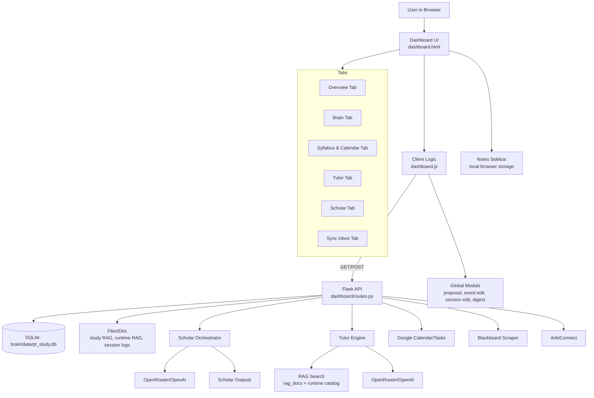

# Dashboard Audit & Rebuild Plan

> Canonical reference: This document is the single source of truth for dashboard behavior, page wiring, and API dependencies. Update here first.

## Scope
This audit maps the current dashboard layout, UI components, data flows, and API surface so you can rebuild the dashboard by isolating each piece and integrating it one at a time. Sources are the live template (`brain/templates/dashboard.html`), client logic (`brain/static/js/dashboard.js`), documented endpoints (`brain/README.md`), and the current Flask blueprint (`brain/dashboard/routes.py`).

Note: Root route `/` serves the React rebuild; legacy `dashboard.html` remains in the repo for reference and gap mapping.


## Current Layout Inventory (UI Surface)

### Global Shell & Navigation
- **Top navigation header** with logo/brand, arcade-style tab buttons (Dashboard, Calendar, Brain, Scholar, Tutor), and a Notes button. The legacy sidebar/mobile overlay remain in DOM for compatibility but are hidden. This shell drives tab navigation and page title updates. 【F:brain/templates/dashboard.html†L1-L114】【F:brain/templates/dashboard.html†L3167-L3199】
- **Notes sidebar** (client-only local storage notes). 【F:brain/templates/dashboard.html†L3062-L3085】
- **Retro terminal footer** status line. 【F:brain/templates/dashboard.html†L3201-L3215】
- **Inputs/Outputs**: UI router + layout only; notes are local unless wired to `/api/notes`.
- **Status**: Partial (React rebuild shell exists; notes persistence is missing).


### Tab: Dashboard Overview (`#tab-overview`)
- **Quick stats bar**: sessions, uptime, rank, cards. 【F:brain/templates/dashboard.html†L184-L227】
- **Scholar insights panel** (alerts, proposals, questions, findings). 【F:brain/templates/dashboard.html†L229-L304】
- **Patterns & insights** (mode chart, focus areas, retrospective). 【F:brain/templates/dashboard.html†L308-L365】
- **Study trends** (trends chart + legend, period selector). 【F:brain/templates/dashboard.html†L369-L458】
- **Upload log** (drag/drop session log). 【F:brain/templates/dashboard.html†L461-L502】
- **Inputs/Outputs**: `/api/stats/summary`, `/api/stats/trends`, `/api/upload` → sessions in `brain/data/pt_study.db`.
- **Status**: Partial (React rebuild needs parity for charts and upload flow).


### Tab: Brain (`#tab-sessions`)
- **Fast entry**: prompt copy + paste output ingest. 【F:brain/templates/dashboard.html†L511-L597】
- **Latest sessions table** with empty state. 【F:brain/templates/dashboard.html†L600-L653】
- **Quick session entry** (manual form). 【F:brain/templates/dashboard.html†L657-L763】
- **Session resume** (generate + download). 【F:brain/templates/dashboard.html†L770-L789】
- **Brain database sections** (stats, mastery, ingestion status). 【F:brain/templates/dashboard.html†L792-L917】
- **Anki cards**: connection status, drafts table, create card form. 【F:brain/templates/dashboard.html†L922-L1117】
- **Edit session modal** (global modal but used here). 【F:brain/templates/dashboard.html†L1448-L1564】
- **Inputs/Outputs**: `/api/sessions`, `/api/quick_session`, `/api/resume`, `/api/upload`, `/api/cards/*` → `sessions`, `topic_mastery`, `card_drafts` in `pt_study.db`.
- **Status**: Partial (React rebuild missing edit/delete + Anki wiring).


### Tab: Syllabus & Calendar (`#tab-syllabus`)
- **Calendar view**: filters, month/week/day view selector, navigation, grid, legend. 【F:brain/templates/dashboard.html†L1216-L1345】
- **Planned spaced repetition** quick add. 【F:brain/templates/dashboard.html†L1347-L1393】
- **Google Calendar sync** (auth, calendar selection, sync/revoke). 【F:brain/templates/dashboard.html†L1395-L1514】
- **Syllabus list view** with filters and week controls. 【F:brain/templates/dashboard.html†L1520-L1681】
- **Study tasks** list and status counters. 【F:brain/templates/dashboard.html†L1683-L1754】
- **Syllabus import** (prompt + JSON import). 【F:brain/templates/dashboard.html†L1756-L1892】
- **Course color manager**. 【F:brain/templates/dashboard.html†L1894-L1916】
- **Event edit modal** (global modal for course events). 【F:brain/templates/dashboard.html†L1240-L1437】
- **Inputs/Outputs**: `/api/syllabus/*`, `/api/calendar/data`, `/api/calendar/plan_session`, `/api/google/*`, `/api/google-calendar/*`, `/api/google-tasks/*` → `courses`, `course_events`, `study_tasks` in `pt_study.db`.
- **Status**: Partial (React rebuild missing edit/delete + Google write support).


### Tab: Scholar (`#tab-scholar`)
- **Scholar API key config** (provider + key, test). 【F:brain/templates/dashboard.html†L1940-L2018】
- **Run Scholar**: status, safe mode, multi-agent, run log. 【F:brain/templates/dashboard.html†L2020-L2142】
- **Ralph research**: progress + latest summary. 【F:brain/templates/dashboard.html†L2144-L2205】
- **Proposal running sheet**. 【F:brain/templates/dashboard.html†L2207-L2280】
- **Proposals & questions** (pending + answered). 【F:brain/templates/dashboard.html†L2282-L2368】
- **System health & research** (coverage, research topics, gaps, improvements, next steps, latest run summary). 【F:brain/templates/dashboard.html†L2370-L2553】
- **AI Strategic Digest** (generate/save). 【F:brain/templates/dashboard.html†L2555-L2626】
- **Saved Digests** + digest viewer modal. 【F:brain/templates/dashboard.html†L2628-L2720】
- **Proposal viewer modal**. 【F:brain/templates/dashboard.html†L1120-L1188】
- **Inputs/Outputs**: `/api/scholar/*`, `scholar/outputs/*`, `scholar_digests` table → dashboards + question queue.
- **Status**: Active (needs React parity and questions handoff UI).


### Tab: Tutor (`#tab-tutor`)
- **Tutor chat**: mode selector (Core/Sprint/Drill), new session, chat messages, input box. 【F:brain/templates/dashboard.html†L2282-L2354】
- **RAG sources management**:
  - Study RAG folder path selection and sync.
  - Runtime RAG items toggle list.
  - YouTube/URL link ingestion. 【F:brain/templates/dashboard.html†L2361-L2466】
- **Inputs/Outputs**: `/api/chat/:sessionId` (React rebuild), `/api/tutor/*` (legacy), `rag_docs` table, `session_logs` for ingestion.
- **Status**: Partial (React uses adapter chat; full SOP/RAG enforcement WIP).


### Tab: Sync Inbox (`#tab-sync`)
- **Sync Inbox**: run scraper, refresh, review pending events. 【F:brain/templates/dashboard.html†L2963-L3047】
- **Inputs/Outputs**: `/api/sync/*`, `/api/scraper/run` → `course_events` updates.
- **Status**: Partial (React rebuild lacks sync inbox UI).


### Mobile/Legacy Layout
- **Alternate “Brain Database” tab** (`#tab-brain`) appears to duplicate database panels for mobile/legacy navigation. 【F:brain/templates/dashboard.html†L2475-L2556】
- **Legacy sidebar and overlay** are preserved but hidden. 【F:brain/templates/dashboard.html†L84-L114】
- **Inputs/Outputs**: Legacy-only; no React parity.
- **Status**: Deferred (kept for reference).


---

## Client → API Surface (What the UI Calls)
The client requests a broad set of endpoints (sessions, syllabus, tutor, cards, calendar, scholar, sync). These are defined in the JS client and documented in `brain/README.md`, even though the current `dashboard/routes.py` file only exposes a subset (stats/scholar/gcal/gtasks/sync). This mismatch is important to resolve during rebuild. 【F:brain/static/js/dashboard.js†L438-L6999】【F:brain/README.md†L262-L281】【F:brain/dashboard/routes.py†L102-L953】

Status key: **Active** (implemented + used), **Partial** (exists but missing parity), **Deferred** (not implemented yet).


Key endpoint groups (from `brain/README.md` + JS):
- **Sessions**: `/api/sessions`, `/api/quick_session`, `/api/resume`, `/api/upload`, `/api/resume/download`. 【F:brain/README.md†L262-L271】【F:brain/static/js/dashboard.js†L438-L1527】
- **Syllabus/Calendar**: `/api/syllabus/*`, `/api/calendar/data`, `/api/calendar/plan_session`. 【F:brain/README.md†L266-L271】【F:brain/static/js/dashboard.js†L2298-L5284】
- **Tutor**: `/api/tutor/session/start`, `/api/tutor/session/turn`, `/api/tutor/card-draft`, plus RAG management endpoints. 【F:brain/README.md†L278-L281】【F:brain/static/js/dashboard.js†L1631-L2226】
- **Cards/Anki**: `/api/cards/*`. 【F:brain/static/js/dashboard.js†L5755-L6035】
- **Scholar**: `/api/scholar/*`. 【F:brain/static/js/dashboard.js†L2371-L6248】
- **Sync Inbox**: `/api/sync/*`, `/api/scraper/run`. 【F:brain/static/js/dashboard.js†L6403-L6969】【F:brain/dashboard/routes.py†L219-L953】
- **Google Calendar/Tasks**: `/api/gcal/*`, `/api/gtasks/*`. 【F:brain/static/js/dashboard.js†L6571-L6811】【F:brain/dashboard/routes.py†L794-L942】

---

## Backend Modules & Data Sources (Current)
- **Flask app + blueprint**: `brain/dashboard/app.py` registers `dashboard_bp` from `brain/dashboard/routes.py`. 【F:brain/dashboard/app.py†L1-L44】【F:brain/dashboard/routes.py†L77-L105】
- **Calendar data** pulls course events, sessions, and planned study tasks. 【F:brain/dashboard/calendar.py†L1-L92】
- **Tutor engine** integrates RAG, modes, and OpenRouter/OpenAI API calls. 【F:brain/tutor_engine.py†L1-L120】【F:brain/tutor_engine.py†L430-L520】
- **Scholar API** uses configurable providers (OpenRouter/OpenAI). 【F:brain/dashboard/routes.py†L739-L793】
- **Database**: `brain/data/pt_study.db` accessed via `db_setup.py` and module helpers. (Referenced across calendar + routes). 【F:brain/dashboard/calendar.py†L1-L92】【F:brain/dashboard/routes.py†L164-L212】

---

## System Flow (Canonical)

```mermaid
flowchart TD
  User[User] --> UI[React Dashboard UI]
  UI --> Client[Client Router & State]
  Client -->|/api/*| API[Flask API Adapter]

  API --> DB[(Brain DB: pt_study.db)]
  API --> Files[Brain Files<br/>session logs, outputs, rag sources]
  API --> Tutor[Tutor Engine]
  API --> Scholar[Scholar Orchestrator]
  API --> RAG[RAG Index (rag_docs)]

  Tutor --> LLM[Local LLM Provider]
  Tutor --> Sources[Source Packets<br/>NotebookLM]
  Tutor --> Cards[Anki Card Drafts]

  Scholar --> LLM2[Local LLM Provider]
  Scholar --> Outputs[Scholar Outputs]

  API --> GCal[Google Calendar]
  API --> GTasks[Google Tasks]
  API --> Anki[AnkiConnect]
  API --> Obsidian[Obsidian Vault]

  Outputs --> API
  API --> UI
```

Legend:
- Solid arrows show primary data flow.
- Tutor/Scholar use local LLM providers; NotebookLM supplies source packets.

---

## Comprehensive Flow Chart (Legacy Reference)



---


## Rebuild Plan (Isolate → Integrate)

### Phase 0 — Foundation (Shell + Routing)
**Goal**: New dashboard shell with tab routing, shared layout, and theming tokens.
- Implement: top nav, tab switcher, notes sidebar (optional), footer.
- Confirm: routing and state management for tabs (Overview, Brain, Syllabus, Tutor, Scholar, Sync).

### Phase 1 — Overview Tab (Read-only metrics first)
- Build quick stats cards (sessions, uptime, rank, cards).
- Add patterns & trends charts with empty state handling.
- Add scholar insights summary panel.

### Phase 2 — Brain Tab (Session system)
- Implement fast entry prompt + ingestion form.
- Implement latest sessions table with edit/delete modal.
- Add quick session entry form + status feedback.
- Add resume generation + download.
- Add brain database stats, topic mastery, ingestion status panels.
- Add Anki card drafts + sync panel.

### Phase 3 — Syllabus & Calendar Tab
- Implement calendar view (month/week/day) + filters + nav.
- Implement list view + week selector + filters.
- Add planned spaced repetition creation.
- Add event edit modal.
- Add study tasks list + status counts.
- Add syllabus import (prompt + JSON import).
- Add course color manager.
- Defer Google Calendar sync until Phase 6 (external integration).

### Phase 4 — Tutor Tab
- Build chat interface (mode select, new session, message log, input).
- Add RAG source management (study folder, runtime items, link ingestion).
- Verify Tutor session endpoints + card draft creation.

### Phase 5 — Scholar Tab
- Implement API key configuration.
- Implement run status + safe mode/multi-agent.
- Add proposals/questions panel + proposal viewer modal.
- Add Ralph research summary + proposal running sheet.
- Add system health/research/gaps panel.
- Add strategic digest + saved digests + digest viewer modal.

### Phase 6 — Sync Inbox + External Integrations
- Implement sync inbox list and actions.
- Integrate Blackboard scraper trigger.
- Implement Google Calendar/Tasks sync configuration + status.
- Validate Anki sync integration.

### Phase 7 — Legacy/Compatibility Pass
- Reconcile duplicate “Brain Database” mobile tab (`#tab-brain`) with the primary Brain tab.
- Remove or preserve legacy sidebar if still required by JS.
- Confirm all modals render correctly and are reachable from new layout.

### Phase 8 — End-to-End QA
- Validate all API calls align with available endpoints (resolve gaps between JS and `routes.py`).
- Run dashboard through critical user flows (session entry, calendar, tutor chat, scholar run, sync inbox).

---

## Risks / Gaps to Resolve
- **Endpoint parity**: The JS client references many endpoints that are not currently defined in `dashboard/routes.py`, while `brain/README.md` documents a larger surface area. The rebuild should verify which endpoints exist and restore any missing API routes before integration. 【F:brain/static/js/dashboard.js†L438-L6999】【F:brain/README.md†L262-L281】【F:brain/dashboard/routes.py†L102-L953】
- **Duplicate Brain tab**: There is a secondary `#tab-brain` with a similar “Brain Database” layout. Decide whether to merge or drop it during rebuild to avoid duplicated UI logic. 【F:brain/templates/dashboard.html†L2475-L2556】

