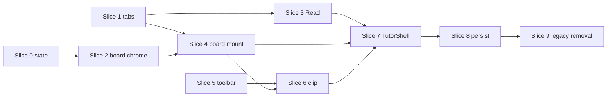

# Tutor Stage Shell — TDD Implementation Plan

**Status:** Complete for v1 — Slices 0–9 landed. Opt out with `viewer_state.stage_shell_v1: false`. Vitest keeps legacy shell unless `stage_shell_v1: true`.  
**Wireframe:** `.cursor/projects/.../canvases/tutor-stage-shell-wireframe.canvas.tsx` (Proposed layout)  
**Baseline audit:** `docs/audit/TUTOR_PAGE_AUDIT_2026-05-19.md`  
**Canon:** `README.md` presets `priming` / `study` / `polish` / `full_studio`

---

## 1. Goal

Replace the **whole-page Floating Studio canvas** (`StudioShell` + `TransformWrapper` + draggable `panel_layout`) with a **fixed stage shell**:

| Region | Behavior |
|--------|----------|
| **Top tabs** | Sources · Read · Prime · Teach · Polish · Settings (+ optional Overview) |
| **Stage** | One primary surface per tab (solo-width dock, priming, tutor, polish) |
| **Left rail** | Source Shelf (~200–260px) on Sources / Read |
| **Right rail** | Run Config + Memory on productive tabs (never ⅓ canvas width) |
| **Session board** | Shared tldraw/graph surface **below** Read / Prime / Teach / Polish — not a top-level tab |
| **Board chrome** | `split` \| `collapsed` \| `fullscreen` (wireframe controls) |
| **Board tools** | Select, Pen, Mind map, Concept map, etc. on **one** canvas — not `StudioWorkspaceUnified` nav tabs |

**In / out:** Clips and priming/polish objects still land on the **same** session board; Document Dock and Source Shelf feed it without switching to a “Board” tab.

---

## 2. TDD rules for this track

Follow **vertical slices** (one behavior → one test → minimal pass → refactor). Do **not** batch all RED tests then all GREEN.

| Rule | Application |
|------|-------------|
| Test **public behavior** | Tab labels, board visibility, collapse/fullscreen, clip lands on canvas — not internal React state names |
| **Deep modules** | `boardLayoutState.ts`, `tutorStageLayout.ts` — small APIs, testable without mounting tldraw |
| **Defer tldraw** | Mock `StudioTldrawWorkspace` / `StudioWorkspaceUnified` in shell tests; keep existing `TutorShell.test.tsx` clip tests, extend with layout assertions |
| **Build gate** | After each slice touching `dashboard_rebuild/`: `npm run test -- <paths>` then `npm run build` |
| **Backend** | Optional: extend `viewer_state` or `runtime_state` for `board_layout_mode`; default tests stay frontend-only until Slice 8 |

**Claim work** in `docs/root/TUTOR_TODO.md` under Current Sprint before Slice 1 lands in `TutorShell`.

---

## 3. Target component map

```
TutorShell
└── TutorStageShell          ← NEW (replaces StudioShell wrapper for study path)
    ├── TutorStageTabBar
    ├── TutorStageViewport   ← per-tab stage content
    │   ├── Read: SourceShelfRail + StudioDocumentDock
    │   ├── Prime: TutorWorkflowPrimingPanel (+ optional doc ref)
    │   ├── Teach: Tutor chat column
    │   └── Polish: Polish panel
    └── TutorSessionBoard    ← NEW chrome + StudioWorkspaceUnified (refactored)
        ├── BoardLayoutChrome (split / collapsed / fullscreen)
        └── StudioWorkspaceToolbar (replaces Canvas | Mind | Concept tabs)
```

**Keep unchanged initially:** `StudioDocumentDock`, `documentPaneLayout`, `SourceShelf`, `handleClipExcerpt` contract, `TutorProjectShellState.panel_layout` (legacy) until Slice 7.

**Retire gradually:** `StudioShell` floating canvas for `study` preset; keep behind flag or `full_studio` until parity.

---

## 4. Persistence sketch

Store in `TutorProjectShellState.viewer_state` (or typed extension after API review):

```ts
type BoardLayoutMode = "split" | "collapsed" | "fullscreen";
type TutorStageTab = "sources" | "read" | "prime" | "teach" | "polish" | "settings";

interface TutorStageViewerState {
  active_tab: TutorStageTab;
  board_layout_mode: BoardLayoutMode;
  board_split_ratio?: number; // 0.35–0.65, default ~0.45
}
```

**Migration:** On restore, if `panel_layout.length > 0` and no `viewer_state.active_tab`, map `last_mode` → tab (`priming` → prime, `study` → read, etc.) and ignore x/y positions for study path.

---

## 5. Vertical slices (tracer bullets)

Each slice: **RED → GREEN → refactor**. Run only the listed test paths until the slice is green.

### Slice 0 — Board layout state machine (pure)

**Behavior:** Given `split`, user can transition to `collapsed` or `fullscreen`; `fullscreen` only exits via explicit exit; `collapsed` expands back to `split`.

| | |
|---|---|
| **Test** | `dashboard_rebuild/client/src/lib/__tests__/boardLayoutState.test.ts` |
| **Impl** | `dashboard_rebuild/client/src/lib/boardLayoutState.ts` — `getNextBoardLayoutMode`, `boardLayoutModeLabel`, defaults per tab (Sources → `collapsed`) |
| **Done when** | All transitions covered; invalid transition returns unchanged mode |

---

### Slice 1 — Stage tab model

**Behavior:** Shell renders tab bar with Sources, Read, Prime, Teach, Polish, Settings; clicking changes visible stage test id; Settings does not mount session board.

| | |
|---|---|
| **Test** | `dashboard_rebuild/client/src/components/tutor-stage/__tests__/TutorStageShell.tabs.test.tsx` |
| **Impl** | `TutorStageShell.tsx`, `tutorStageTabs.ts` — render props for stages; mount in isolation (no `TutorShell` yet) |
| **Done when** | `screen.getByTestId("tutor-stage-read")` visible after click; board region absent on Settings |

---

### Slice 2 — Session board chrome (no tldraw)

**Behavior:** Board region shows toolbar placeholder + layout buttons; Collapse → strip height; Fullscreen → stage hidden, board `data-layout="fullscreen"`; Expand → `split`.

| | |
|---|---|
| **Test** | `.../tutor-stage/__tests__/TutorSessionBoard.chrome.test.tsx` |
| **Impl** | `TutorSessionBoard.tsx`, `BoardLayoutChrome.tsx` — uses Slice 0 state |
| **Done when** | Three modes togglable in test; split shows both stage and board containers |

---

### Slice 3 — Read stage layout

**Behavior:** Read tab shows narrow Source Shelf rail + Document Dock as main stage; board in split below dock.

| | |
|---|---|
| **Test** | `.../tutor-stage/__tests__/TutorStageShell.read.test.tsx` — mock `SourceShelf`, `StudioDocumentDock` |
| **Impl** | `TutorStageRead.tsx` — flex row: rail `w-[240px]` max, dock `flex-1` |
| **Done when** | Shelf + dock test ids present; rail not wider than 280px in class/DOM assertion |

---

### Slice 4 — Wire session board (mock workspace)

**Behavior:** Under Read/Prime/Teach/Polish, `TutorSessionBoard` renders mocked workspace; Prime/Teach/Polish stages show stage + board split.

| | |
|---|---|
| **Test** | `.../tutor-stage/__tests__/TutorStageShell.board-mount.test.tsx` |
| **Impl** | Pass `children` or `renderWorkspace` into `TutorSessionBoard` |
| **Done when** | `data-testid="tutor-session-board"` under read; not under settings |

---

### Slice 5 — Workspace toolbar modes (replace nav tabs)

**Behavior:** User activates “Mind map” / “Concept map” from toolbar; active tool reflected in `data-workspace-tool`; no top-level Canvas/Mind/Concept tabs.

| | |
|---|---|
| **Test** | `dashboard_rebuild/client/src/components/studio/__tests__/StudioWorkspaceUnified.toolbar.test.tsx` |
| **Impl** | Refactor `StudioWorkspaceUnified.tsx` — `activeTool` instead of `activeTab`; keep lazy mounts + `workspaceTabRequest` compat (map `tab: "canvas"` → tool `select`) |
| **Done when** | Existing tests updated; tab buttons removed from DOM |

---

### Slice 6 — Clip flow without tab switch

**Behavior:** `handleClipExcerpt` focuses session board (expand if collapsed) and sets workspace tool to canvas/select; excerpt visible without user opening Board tab.

| | |
|---|---|
| **Test** | Extend `TutorShell.test.tsx` — “clips active viewer selection” (fix isolation if needed: mock tldraw mount) |
| **Impl** | `TutorShell.tsx` — replace `setWorkspaceTabRequest({ tab: "canvas" })` with `setBoardLayoutMode("split")` + tool request |
| **Done when** | Clip test passes in full file run; board expands from collapsed when clip fires |

---

### Slice 7 — Integrate `TutorStageShell` into `TutorShell` (feature flag)

**Behavior:** When `useStageShell === true` (env or `viewer_state`), study/priming/polish paths render `TutorStageShell` instead of `StudioShell`; floating `panel_layout` not written on layout drag.

| | |
|---|---|
| **Test** | `TutorShell.stage-shell.test.tsx` — flag on → no `studio-canvas` / `TransformWrapper`; flag off → legacy |
| **Impl** | `TutorShell.tsx` branch; map presets: `study` → Read tab + board; `priming` → Prime; `polish` → Polish |
| **Done when** | Default dev flag on; `npm run build` clean |

---

### Slice 8 — Persist tab + board mode

**Behavior:** Changing tab or board mode updates `viewer_state` on debounced project-shell save; restore reopens same tab and board mode.

| | |
|---|---|
| **Test** | `tutor.test.tsx` or `tutor.workspace.integration.test.tsx` — save payload includes `viewer_state.active_tab` |
| **Impl** | `tutor.tsx` merge viewer_state; optional backend schema doc only |
| **Done when** | Integration test asserts round-trip |

---

### Slice 9 — Remove legacy study canvas (flag default on)

**Behavior:** Study preset no longer uses `PRESET_PANEL_KEYS` floating positions; `panel_layout` cleared on first stage-shell session.

| | |
|---|---|
| **Test** | `StudioShell.test.tsx` — study preset still works for `full_studio`; stage shell does not import canvas lock pan/zoom |
| **Impl** | Update `PRESET_PANEL_KEYS` / docs; `TUTOR_PAGE_AUDIT` addendum |
| **Done when** | Live smoke: Read → clip → board shows excerpt (`scripts/live_tutor_smoke.py` + manual) |

---

## 6. Test commands (per slice)

```bash
cd dashboard_rebuild
npm run test -- client/src/lib/__tests__/boardLayoutState.test.ts
npm run test -- client/src/components/tutor-stage
npm run test -- client/src/components/studio/__tests__/StudioWorkspaceUnified.toolbar.test.tsx
npm run test -- client/src/components/__tests__/TutorShell.test.tsx
npm run test -- client/src/pages/__tests__/tutor.workspace.integration.test.tsx
npm run build
```

Backend (if `viewer_state` schema enforced):

```bash
pytest brain/tests/test_tutor_project_shell.py -q
```

---

## 7. Out of scope (defer)

- Popout windows (`workspacePanelPopout`) on stage shell v1  
- Overview grid tab (wireframe only) unless user promotes it  
- Replacing `full_studio` / `minimal` floating presets  
- Backend migration of historical `panel_layout` coordinates  
- New Anki/Obsidian export rails (keep Export stage panels as-is or hide behind Settings)

---

## 8. Risks and mitigations

| Risk | Mitigation |
|------|------------|
| tldraw mount flakiness in Vitest | Mock workspace in shell slices; one integration test with deferred mount |
| `TutorShell.test.tsx` size | New tests under `tutor-stage/`; only clip + flag tests touch mega file |
| Dual layout during migration | Feature flag + `last_mode` mapping; document in audit |
| Board fullscreen vs page fullscreen | Board fullscreen = in-shell only; do not call browser Fullscreen API v1 |

---

## 9. Definition of done (track)

- [ ] All slices 0–9 green locally  
- [ ] `npm run build` in `dashboard_rebuild/`  
- [ ] `TUTOR_TODO.md` task checked with assignee + completed notes  
- [ ] `docs/audit/TUTOR_PAGE_AUDIT_2026-05-19.md` §2 layout updated  
- [ ] Manual: Read tab → open material → clip → board shows shape without tab hunting  

---

## 10. Suggested `TUTOR_TODO.md` entry (paste into Current Sprint)

```markdown
- [ ] **Tutor stage shell (wireframe → prod)** — @Cursor
  - TDD plan: `docs/plans/TUTOR_STAGE_SHELL_TDD_PLAN.md`
  - Slices 0–9; flag `TutorStageShell` in `TutorShell`
  - Done when: Read/Prime/Teach/Polish use stage+board; board split/collapsed/fullscreen; workspace toolbar replaces tabs; clip expands board
```

---

## 11. Slice dependency graph



**Recommended next step:** Slice 0 + Slice 1 in one PR (no `TutorShell` wiring yet) — smallest reviewable tracer.
