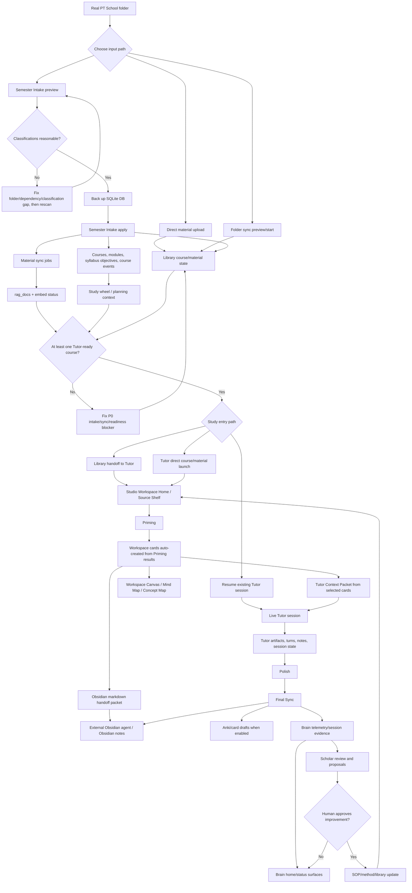

# PT Study OS Complete Study Loop Flow And Gap Review

Last updated: 2026-05-13

Authority note: `README.md` remains the product/source-of-truth document. This file is the operational map and gap ledger for proving the current app against Trey's real PT coursework folder.

## Goal

Map and test the complete loop from coursework input to live studying and system improvement:

1. Bring current PT School coursework into Library.
2. Verify courses, setup files, schedules, materials, sync jobs, and embedded `rag_docs`.
3. Launch or resume Tutor from a selected real course/material.
4. Move through Priming, Workspace cards/concept mapping, Tutor, Polish, and Final Sync where available.
5. Confirm Brain telemetry and Scholar/SOP improvement paths remain connected.
6. Classify and close only gaps that block real studying or distort the intended loop.

## Full Loop Map

## Decision Paths To Verify

- Semester Intake:
  - New course folder creates or updates a course.
  - Existing course folder maps to the existing course instead of duplicating it.
  - Syllabus/setup files are parsed into modules/objectives where possible.
  - Schedule files are parsed into course events where possible.
  - Material files launch material sync jobs.
  - Global schedule files are visible for review and not silently treated as a course.
  - Ignored/admin files stay out of Tutor scope.
  - Unassigned materials are visible so they can be handled manually.
- Library alternatives:
  - Direct upload remains available for one-off files.
  - Folder sync remains available for selective import.
  - Library material selection can hand off to Tutor.
- Tutor readiness:
  - A real course has at least one enabled material.
  - Workspace Context can start Tutor directly from selected course/material/study unit.
  - Preflight is no longer a required user-facing session gate.
  - Priming results create editable Workspace cards automatically.
  - Workspace cards can be edited, hidden, deleted, selected for Tutor, and selected for Obsidian.
  - Workspace card buckets populate from Priming cards instead of showing empty counts.
  - Tutor startup packet includes cards marked for Tutor context.
  - Obsidian handoff generates a structured markdown packet from cards marked for Obsidian.
  - A Tutor session can be created, restored, summarized, ended, or resumed.
  - Scoped retrieval carries explicit selected `material_ids` and an `accuracy_profile`.
- Loop completion:
  - Tutor turns and artifacts persist.
  - Polish and Final Sync surfaces are reachable from the workflow shell.
  - Obsidian, Anki/card drafts, Brain telemetry, and Scholar proposal paths are represented truthfully.

## Real Folder Result

Tested folder: `/Users/fst/Library/CloudStorage/OneDrive-Personal/Desktop/PT School`

Semester Intake preview found:

- 3 course folders with supported files.
- 6 syllabus files.
- 6 schedule files, including 1 global schedule under `00_Class schedules`.
- 27 material files.
- 14 ignored/admin files under `90_Misc/EXXAT Uploads`.
- 0 unassigned material files.

Current course interpretation:

| Course | Code | Preview result | Tutor readiness |
| --- | --- | --- | --- |
| Dx Mgmt Integumtary | PHYT 6262 | Existing course matched by code despite folder typo. Syllabus found. No current materials in that folder. | Not ready yet. Needs material files. |
| Assistive Technology and Functional training | PHYT 6424 | Existing course matched. Syllabus, schedule, and 22 material files found. | Ready: existing embedded material is present. |
| Professionalism | PHYT 6109 | Existing course matched. Syllabus, schedule, and 5 material files found. | Ready: 2 embedded materials and grouped study-unit objectives are present. |

`11_Movement Science II` and `14_Cardiovascular Pulmonary` exist as folders but currently contain only `.DS_Store`, so they do not appear in Semester Intake yet. That is not an intake classifier failure; they need at least one supported syllabus, schedule, or material file.

## Validation Matrix

Status values:

- `PASS`: tested this run and working.
- `GAP`: tested this run and mismatched/broken.
- `NOT TESTED`: not yet exercised in this run.
- `DEFER`: known non-blocking follow-up.

| Area | Check | Status | Evidence / Notes |
| --- | --- | --- | --- |
| Baseline | `git status --short` captured before new changes | PASS | Existing dirty files preserved: Tutor header CSS/TSX from prior fix. |
| Baseline | `npm run check` | PASS | TypeScript check passed in `dashboard_rebuild`. |
| Baseline | `npm run build` | PASS | Vite build passed and regenerated `brain/static/dist`. |
| Baseline | `pytest brain/tests/test_semester_intake.py -q` | PASS | 6 passed, 5 warnings from third-party SWIG import deprecations. |
| Baseline | Focused Tutor/session/intake smoke regressions | PASS | `.venv/bin/python -m pytest brain/tests/test_tutor_session_linking.py brain/tests/test_semester_intake.py brain/tests/test_live_tutor_smoke.py -q`: 51 passed, 5 third-party SWIG deprecation warnings. |
| Workspace | Priming results auto-create Workspace cards | PASS | `TutorWorkflowPrimingPanel.test.tsx` proves non-visual result blocks auto-capture as `text_note` Workspace cards. |
| Workspace | Sidebar buckets count Priming cards | PASS | `StudioWorkspaceMaterialSidebar.test.tsx` proves Priming Workspace cards appear in Learning Objectives and related buckets. |
| Workspace | Card controls | PASS | `StudioTldrawWorkspace.test.tsx` proves edit, hide, delete, Tutor selection, and Obsidian selection on Workspace cards. |
| Workspace | Obsidian markdown handoff | PASS | `obsidianHandoffPacket.test.ts` and `StudioTldrawWorkspace.test.tsx` prove selected cards serialize/copy as structured markdown. |
| Tutor | Workspace Context direct start | PASS | `useTutorSession.test.tsx` proves frontend starts Tutor via `createSession` directly with course/material/objective context, not `/session/preflight`. |
| Baseline | Focused Library frontend test | PASS | `npm run test -- client/src/pages/__tests__/library.test.tsx`: 3 passed. |
| App health | `Start_Dashboard.command` / health endpoint | PASS | Dashboard restarted through the Mac launcher path and healthy on `http://127.0.0.1:5127/api/brain/status`: `ok: true`, 3 `rag_documents`, 1 active session. |
| Real folder | Semester Intake preview of OneDrive PT School folder | PASS | Counts: 3 courses, 6 syllabus, 6 schedule, 27 material, 14 ignored, 0 unassigned. |
| Intake apply | DB backup before real apply | PASS | Backup created at `brain/data/backups/pt_study_before_study_loop_apply_2026-05-13.db`. |
| Intake apply | Apply reviewed classifications only | PASS | Applied structure only after review: 0 new courses, 3 updated, 6 setup files parsed, 14 objectives created, 0 setup parse errors, 0 material sync jobs. |
| Library state | Courses/materials/sync jobs/rag_docs/embed status | PASS | 3 courses; 3 enabled `rag_docs`; embed status total 3, embedded 3, pending 0, stale 0. |
| Tutor | Safe local Tutor path | PASS | `scripts/live_tutor_smoke.py --base-url http://127.0.0.1:5127 --skip-turn` passed. It created/restored/summarized/ended/deleted a material-scoped Professionalism session without calling the external model. |
| Tutor | `scripts/live_tutor_smoke.py` full model-backed turn | DEFER | Not run by Codex because the turn step can send selected coursework to the configured external LLM provider; run only with explicit user approval. |
| Browser | `/brain`, `/library`, and `/tutor` rendered checks | PASS | Built-in browser opened Brain, Library, and Tutor. Library showed `SEMESTER INTAKE` plus course names; Tutor opened `Professionalism` live session `tutor-20260513-101225-0c7ef7` with 2 materials, no visible Preflight, and no console errors. |

## Gap Register

| Priority | Gap | Current Evidence | Action |
| --- | --- | --- | --- |
| P0 | Semester Intake could duplicate typo-named folders instead of matching the existing course by course code. | `10_Dx Mgmt Integumtary` contains `PHYT 6262` but the existing course is named `Dx Mgmt Integumentary`. | Fixed: preview/apply infer `PHYT ####` from folder/files and match existing courses by code. |
| P0 | Intake could create modules with no grouped objectives, leaving Tutor without a study-unit start handle. | Professionalism had modules/events but zero learning objectives, so `live_tutor_smoke` could not find a preflight-ready scope. | Fixed: apply now assigns objective `group_name` to the module/study unit and creates a conservative fallback `Study <module>` objective when setup parsing finds modules but no explicit objectives. |
| P0 | Tutor preflight hard-failed when the course was not mapped into the Obsidian vault, even with selected embedded materials. | Professionalism preflight returned `Unmapped vault course 'Professionalism'...`. | Fixed: unmapped MoC context is now a warning for material-backed sessions, not a blocking 500. |
| P0 | Preflight was still a required user-facing Tutor start gate. | Frontend called `/api/tutor/session/preflight` before `createSession`; backend rejected direct objective-scoped sessions with `PREFLIGHT_REQUIRED`. | Fixed: frontend sends Workspace Context directly to `createSession`; backend accepts objective/material context without a preflight id. |
| P0 | Priming outputs did not become the active Workspace thinking table. | Text-only Priming blocks previously stayed in the Priming panel unless manually promoted; sidebar buckets stayed empty. | Fixed: Priming result blocks auto-create Workspace cards and sidebar buckets include them. |
| P1 | Workspace cards lacked first-use controls for the study loop. | The workbench showed notes/excerpts but did not let the user edit, hide, delete, or mark cards for Tutor/Obsidian. | Fixed for Workspace cards: edit/hide/delete plus Tutor and Obsidian selection toggles are available. |
| P1 | External Obsidian workflow required manual copy-chaining. | User had to copy Priming output to an external Obsidian agent by hand. | Fixed: Workspace can copy a structured Obsidian markdown handoff packet from selected cards. |
| P1 | Semester Intake preview always reported embeddings as pending and `readyForTutor: false`. | Assistive Technology and Professionalism had embedded materials but preview showed not ready. | Fixed: preview now reads existing `rag_docs`/`rag_embeddings` and marks existing embedded courses ready. |
| P1 | Full material apply would try to sync 27 files, including a 268 MB textbook, even though enough material is already embedded to study today. | Real preview includes `OSullivan Physical Rehabilitation 7th Ed.pdf` at 268 MB. | Deferred: structure-only apply was used today; selectively sync additional files from Library when needed. |
| P1 | Assistive Technology is material-ready but has no parsed study-unit objectives yet. | AT has 1 embedded TXT and 22 previewed material files, but the setup parser did not extract modules/objectives from its files. | Deferred: usable for material review, but a better AT module/objective parser or manual objective approval is still needed. |
| P2 | Old flowcharts do not represent the current in-app Semester Intake path. | Existing `docs/flowcharts/01-system-overview.mmd` starts from generic material ingestion, not the current Library intake workflow. | Keep this doc as the truthful loop map; add `docs/flowcharts/07-complete-study-loop.mmd` only if the embedded diagram becomes too large. |
| P2 | Existing docs mix older M0-M6 language with current Studio workflow language. | README is current truth; historical flowcharts are older visual companions. | Do not refactor old docs today unless they confuse the study-now path. |

## Study-Now Handoff

- Ready course: Professionalism (`PHYT 6109`).
- Ready study unit: `Week 1: The Future of Healthcare Systems and Why Leadership is Needed`.
- Ready materials:
  - `PHYT 6109 VS Class 1 - Course Orientation and Professionalism Training Lab 1.pdf`
  - `Developing Habits of the Heart - Polly 2019.pdf`
- Open path: `http://127.0.0.1:5127/tutor?course_id=3&session_id=tutor-20260513-101225-0c7ef7`.
- Start/resume action: open Tutor and click `RESUME` on the live session. The session is already created, material-scoped, and restorable.
- What was fixed: course-code matching, fallback grouped objectives, material-backed preflight without required Obsidian vault mapping, and truthful intake readiness.
- What remains imperfect but non-blocking: no model-backed Tutor turn was run by Codex without explicit approval to send coursework to the configured provider; the active session carries a non-blocking Obsidian map-of-contents warning because Professionalism is not mapped in the vault yet; AT/CV/Movement need more setup/objective work; full 27-file sync was intentionally deferred.
