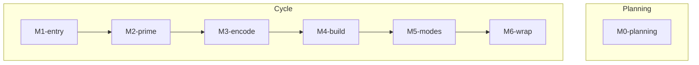

# System Map — [Date]

- Auditor: The Scholar
- Scope: Tutor System (v9.2)

## 1. System Inventory

| Module | Purpose | Inputs | Outputs | Dependencies | Risk |
|---|---|---|---|---|---|
| | | | | | |

## 2. Dependency Graph

## 3. Definitions & Glossary Anchors

## 4. Known Overlaps / Ambiguities

- [Observation]

## 5. Known Missing Components (Hypotheses)

- [Gap Hypothesis]

## 6. ONE Primary Recommendation (optional)

- Recommendation:
- Why it matters:
