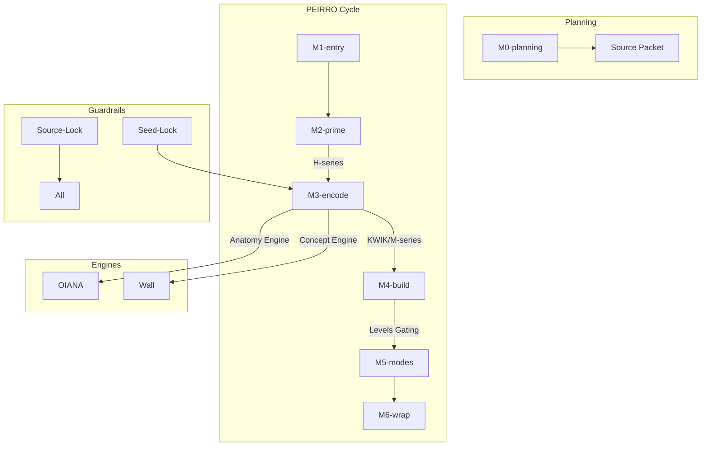

# System Map — 2026-01-07

- Auditor: The Scholar
- Scope: Tutor System (v9.2)

## 1. System Inventory

| Module | Purpose | Inputs | Outputs | Dependencies | Risk |
|---|---|---|---|---|---|
| PEIRRO | Core learning cycle | Session target | Understanding | Gated Platter | Process-heavy |
| KWIK | Encoding flow | Phonetic cues | Recall hook | M3 Encode | Over-elaboration |
| Levels | Depth control | User response | Gated access | None | Recognition drift |
| H-Series | Priming/Hierarchy | Raw topic | Map/Buckets | M2 Prime | Complexity |
| M-Series | Logic/Process | Buckets | Explanations | M3/M4 | Passive drift |
| Y-Series | Rapid Context | Terms | orientation | M2/M3 | Thinness |
| Anatomy Engine | Surgical mapping | Bones/landmarks | Mental atlas | M0–M6 | OIANA skip |
| Concept Engine | Theory mapping | Non-anatomy | Conceptual wall | M0–M6 | Abstraction |
| NotebookLM Bridge | Grounding | Source Packet | Grounded claims | All engines | Hallucination |
| Log Template | Telemetry capture | Metrics/Findings | Data artifact | All modules | Field omission |

## 2. Dependency Graph

## 3. Definitions & Glossary Anchors

- **Seed-Lock**: The user-generated analogy that "hooks" a term to a known concept.
- **Source-Lock**: The protocol requiring the AI to use ONLY the provided Source Packet for facts.
- **Gated Platter**: The progression of AI help (Metaphor -> Scaffold -> Answer) when a user stays passive.

## 4. Known Overlaps / Ambiguities

- **M2 vs H1**: M2 Prime frequently defaults to H1 scans, making the distinction between the phase (M2) and the tool (H1) blurry.
- **KWIK vs M-series**: KWIK is used for encoding terms, while M-series handles processes; there is overlap when a term describes a process.

## 5. Known Missing Components (Hypotheses)

- **Retention Monitor**: No active tracking of anchor decay across multiple sessions.
- **Cross-Topic Interleaving**: The current logic is highly "topic-blocked."

## 6. ONE Primary Recommendation (optional)

- Recommendation: **Consolidate Gated Platter into Levels Module.**
- Why it matters: Centralizing all "difficulty/depth" logic into the Levels file reduces logic sprawl across M3 and M4.
