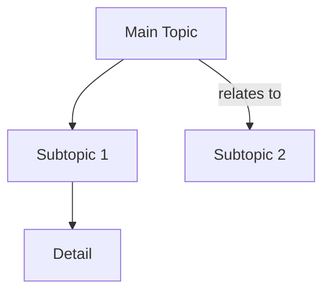

# Canonical Artifact Spec

Machine-readable output formats that the PT Study system parses.
Each format matches an existing parser — do NOT deviate or the pipeline breaks.

---

## 1. Anki Card Draft (Batch Chain Runner)

**Parser:** `brain/chain_runner.py` → `_parse_card_output()`
**Trigger:** block with `artifact_type: cards` or `name == "Anki Card Draft"`

### Required Format

```
CARD 1:
TYPE: basic
FRONT: What is the primary action of the supraspinatus?
BACK: Initiates shoulder abduction (first 15 degrees)
TAGS: anatomy, shoulder, rotator-cuff

CARD 2:
TYPE: cloze
FRONT: The {{c1::supraspinatus}} initiates abduction
BACK: Supraspinatus muscle
TAGS: anatomy, rotator-cuff
```

### Rules
- Each card starts with `CARD N:` (N = sequential integer, line ends with colon)
- `TYPE:` required — value must be `basic` or `cloze`
- `FRONT:` required — single line, non-empty
- `BACK:` required — single line, non-empty
- `TAGS:` optional — comma-separated tags
- Blank line between cards (recommended but not required by parser)
- For cloze cards: FRONT must contain `{{c1::...}}` syntax
- Case-insensitive label matching (FRONT/Front/front all work)

### Validation Criteria
- At least 1 card parsed (FRONT + BACK both present)
- TYPE is `basic` or `cloze`
- Cloze cards contain `{{c` pattern in FRONT

---

## 2. Anki Card Draft (WRAP Parser)

**Parser:** `brain/wrap_parser.py` → `extract_anki_cards()`
**Trigger:** WRAP Section B content

### Required Format

```
Front: What does the anterior cruciate ligament (ACL) resist?
Back: Anterior tibial translation and internal rotation
Tags: knee, ligaments
Source: Neumann Ch. 13
```

### Rules
- Labels: `Front:`, `Back:`, `Tags:`, `Source:` (case-insensitive)
- `Front:` and `Back:` are required (either present = valid card)
- `Tags:` and `Source:` are optional
- Multi-line values allowed (continuation lines without a label prefix)
- Card number headers (`1.`, `**1**`, `Card 1:`) flush previous card
- Markdown bold (`**Front:**`) is accepted

---

## 3. Mermaid Diagram

**Parser:** `dashboard_rebuild/client/src/lib/mermaid-to-reactflow.ts` → `parseMermaid()` + `extractMermaidBlocks()`
**Trigger:** blocks with `artifact_type` of `concept-map`, `flowchart`, or `decision-tree`

### Required Format

````

````

### Rules
- Must be fenced: `` ```mermaid `` ... `` ``` ``
- First non-empty line inside fence must be `graph TD`, `graph TB`, `graph LR`, or `graph RL`
- `flowchart` keyword is NOT supported by the parser — use `graph` only
- Node labels: `A["Label"]` (square brackets + quotes), `A("Label")` (parens), `A{"Label"}` (curly)
- Plain node IDs (`A`) get their ID as label
- Edges: `A --> B` (simple), `A -->|label text| B` (labeled)
- `subgraph`, `end`, `style`, `classDef`, `linkStyle` lines are skipped (tolerated but not parsed)
- At least 2 nodes and 1 edge required for a valid diagram

### Allowed Graph Types
| `artifact_type` | Graph Direction |
|-----------------|----------------|
| `concept-map` | `graph TD` or `graph LR` |
| `flowchart` | `graph TD` |
| `decision-tree` | `graph TD` |

---

## 4. Comparison Table

**Consumer:** No dedicated parser — rendered as markdown in Obsidian notes and tutor chat.
**Trigger:** blocks with `artifact_type: comparison-table`

### Required Format

```markdown
| Feature | Concept A | Concept B |
|---------|-----------|-----------|
| Function | ... | ... |
| Structure | ... | ... |
| Clinical Relevance | ... | ... |
```

### Rules
- Standard markdown table syntax
- Header row + separator row + data rows
- Minimum 2 columns (concepts) + 1 feature column
- No parser validation (rendered as-is) — but must be valid markdown table

---

## 5. JSON Session Logs (WRAP Section D)

**Parser:** `brain/wrap_parser.py` → `extract_json_logs()` → `ingest_session._parse_json_payloads()`
**Trigger:** WRAP Section D content

### Required Format

````
```json
{
  "session_id": "2026-02-14_shoulder-anatomy",
  "date": "2026-02-14",
  "course": "MSK 1",
  "topic": "Shoulder Anatomy",
  "mode": "Core",
  "duration_min": 45,
  "source_lock": true
}
```
````

### Rules
- Must be fenced: `` ```json `` ... `` ``` ``
- Valid JSON object
- Keys are string-matched (see `_extract_metadata` in wrap_parser.py)

---

## Artifact Type → Format Mapping

| `artifact_type` | Expected Format | Parser |
|-----------------|-----------------|--------|
| `cards` | Anki Card Draft (batch) | `chain_runner._parse_card_output` |
| `concept-map` | Mermaid `graph TD\|LR` | `mermaid-to-reactflow.parseMermaid` |
| `flowchart` | Mermaid `graph TD` | `mermaid-to-reactflow.parseMermaid` |
| `decision-tree` | Mermaid `graph TD` | `mermaid-to-reactflow.parseMermaid` |
| `comparison-table` | Markdown table | (rendered as-is) |
| `outline` | Markdown headers + bullets | (rendered as-is) |
| `mindmap` | Markdown headers + bullets | (rendered as-is) |
| `illness-script` | Markdown sections | (rendered as-is) |
| `error-log` | Markdown bullets | (rendered as-is) |
